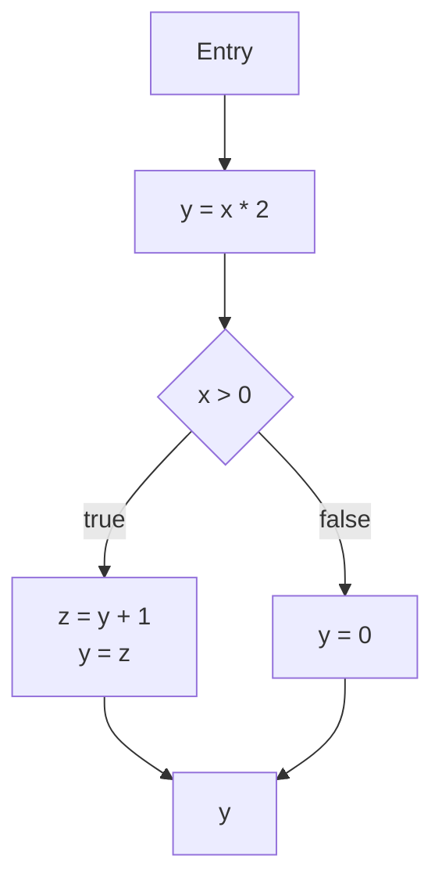

# Control Flow Graph (CFG) for Ruby LSP

## Overview
This document outlines the design and implementation of a lightweight Control Flow Graph (CFG) for Ruby code analysis in the Ruby LSP. The CFG enables precise data-flow analysis to power features like "Go to Definition" with control-flow sensitivity.

## Why CFG?

A CFG provides a structured way to model the flow of execution in Ruby methods, enabling:
- Precise reachability analysis for variable definitions
- Support for complex control flow (conditionals, loops, exceptions)
- Foundation for future analyses (e.g., unused variables, constant propagation)
- More accurate than heuristics for edge cases

## Local Variable Analysis Example

Consider the following Ruby method:

```ruby
def calculate(x)
  y = x * 2    # Definition 1 (y)
  if x > 0
    z = y + 1   # Definition 2 (z)
    y = z       # Use of z, Definition 3 (y)
  else
    y = 0       # Definition 4 (y)
  end
  y             # Use of y
end
```

### CFG Construction

1. **Break into Basic Blocks**:
   ```
   Block 1 (B1):
     y = x * 2
     if x > 0

   Block 2 (B2): [if true]
     z = y + 1
     y = z

   Block 3 (B3): [else]
     y = 0

   Block 4 (B4): [join point]
     y
   ```

2. **CFG Structure**:
   ```
      B1
     /  \
    B2  B3
     \  /
      B4
   ```

### Reaching Definitions Analysis

For each block, we track which definitions of variables reach its start and end:

| Block | Incoming Definitions | Generated Definitions | Outgoing Definitions |
|-------|----------------------|-----------------------|----------------------|
| B1    | {}                   | y:1                   | {y:1}                |
| B2    | {y:1}                | z:2, y:3              | {y:3, z:2}           |
| B3    | {y:1}                | y:4                   | {y:4}                |
| B4    | {y:3, y:4}           | -                     | {y:3, y:4}           |


At the use of `y` in B4, the reaching definitions are:
- `y:3` (from B2)
- `y:4` (from B3)

This shows that the final value of `y` could come from either branch of the `if` statement.

## Design

### Graph Structure



### Data Structures for Reaching Definitions

```rust
/// Tracks reaching definitions for all variables in a scope
struct ReachingDefs {
    // Maps variable name to set of definition IDs
    defs: HashMap<String, HashSet<usize>>,
}

impl ReachingDefs {
    fn new() -> Self {
        ReachingDefs { defs: HashMap::new() }
    }

    /// Add a new definition for a variable
    fn add_def(&mut self, var: &str, def_id: usize) {
        self.defs.entry(var.to_string())
            .or_default()
            .insert(def_id);
    }

    /// Merge with another set of reaching definitions
    fn merge(&self, other: &ReachingDefs) -> ReachingDefs {
        let mut result = self.clone();
        for (var, defs) in &other.defs {
            result.defs.entry(var.clone())
                .or_default()
                .extend(defs);
        }
        result
    }
}

/// Performs reaching definitions analysis on a CFG
fn analyze_cfg(cfg: &Cfg) -> HashMap<CfgNodeId, ReachingDefs> {
    let mut in_sets = HashMap::new();
    let mut out_sets = HashMap::new();
    let mut changed = true;

    // Initialize all nodes with empty sets
    for node in cfg.nodes() {
        in_sets.insert(node.id(), ReachingDefs::new());
        out_sets.insert(node.id(), ReachingDefs::new());
    }

    // Fixed-point iteration until no more changes
    while changed {
        changed = false;
        for node in cfg.nodes() {
            // Merge from all predecessors
            let mut in_set = ReachingDefs::new();
            for pred in cfg.predecessors(node.id()) {
                in_set = in_set.merge(&out_sets[&pred]);
            }

            // Apply transfer function (kill/gen)
            let mut out_set = in_set.clone();
            for def in node.definitions() {
                // Kill previous definitions of this variable
                out_set.defs.remove(&def.var);
                // Add new definition
                out_set.add_def(&def.var, def.id);
            }

            // Check for changes
            if in_sets[&node.id()] != in_set || out_sets[&node.id()] != out_set {
                changed = true;
                in_sets.insert(node.id(), in_set);
                out_sets.insert(node.id(), out_set);
            }
        }
    }

    in_sets
}

### Node Types
1. **Entry Node**: Start of the method/block
2. **Exit Node**: Normal method exit (implicit return)
3. **Basic Block**: Sequence of statements with single entry/exit
4. **Branch Node**: `if/unless/elsif/else` conditions
5. **Loop Nodes**: `while/until/for` loops
6. **Jump Nodes**: `break/next/return/raise`

### Data Structures

```rust
enum CfgNode {
    Entry,
    Exit,
    BasicBlock { statements: Vec<Statement> },
    Branch { 
        condition: Expr,
        then_branch: Box<CfgNode>,
        else_branch: Box<CfgNode>,
    },
    Loop {
        condition: Expr,
        body: Box<CfgNode>,
    },
    Jump(JumpKind),
}

struct ControlFlowGraph {
    entry: CfgNode,
    exit: CfgNode,
    // Additional metadata
}
```

## Implementation Phases

### 1. CFG Construction
- Build CFG from Prism AST
- Handle Ruby's control structures:
  - `if/unless/elsif/else`
  - `case/when`
  - `while/until/for` loops
  - `begin/rescue/ensure/else`
  - `break/next/return/raise`

### 2. Reaching Definitions Analysis
- Forward data-flow analysis
- At each program point, track which variable definitions reach that point
- Handle variable assignments and scoping rules

### 3. Integration with LSP
- Map AST nodes to CFG nodes
- Cache CFGs per method/block
- Invalidate cache on file changes

## Example

```ruby
def example(x)
  y = 1           # Definition 1
  if x > 0
    y = 2         # Definition 2
  else
    y = 3         # Definition 3
  end
  y               # Uses: Reaches Defs 2 or 3
end
```

## Performance Considerations
- **Incremental Analysis**: Only rebuild CFG for changed methods
- **Caching**: Cache CFG and analysis results
- **Lazy Evaluation**: Build CFG on-demand for visible code
- **Size Limits**: Skip analysis for very large methods

## Implementation Notes

### Variable Scoping Rules
- A local variable comes into existence the first time the parser sees an assignment **inside the current method or block**. Reads before that point see `nil`.
- A block *inherits* all locals that were already in scope **before the block begins**. Writing to one of those names mutates the outer variable.
- Block parameter lists may declare **block-local variables** after a semicolon (`|args; locals|`). These names exist **only inside the block** and shadow any outer variables with the same name.
- The `for` loop is special: its iterator variable(s) belong to the **enclosing scope**, so they remain visible after the loop. Iterator locals created by `each`, `while`, and `until` are confined to the block.
- Shadowing is allowed. When a new declaration of the same name appears in an inner scope (e.g., block parameter, block-local, rescue variable) it defines a new variable that hides the outer one within that inner scope.

### Key Edge Cases

1. **Conditional / Rescue / Case hoisting**  
   Any assignment that appears in *some* branch (`if`, `elsif`, `else`, `rescue`, `when`) guarantees the variable exists afterwards with value `nil` when the branch was not executed.

2. **Block-local variables (`;`)**  
   ```ruby
   outer = 1
   [1].each do |x; outer|  # "outer" here is a new, block-local var
     outer = x             # does NOT affect the outer scope
   end
   outer # => 1
   ```

3. **Iterator & loop variables**  
   `for i in arr` leaks `i` outside the loop, while iterator variables created by `each`, `while`, `until` stay inside the loop block.

4. **Multiple assignment & splat**  
   ```ruby
   a, (b, *c) = foo
   ```
   Each left-hand target is a separate definition that kills prior defs of that name.

5. **Pattern-matching locals** (Ruby 3.2+)  
   Local names introduced in `in` patterns exist after the `case`, even when the match fails.

6. **Shadowing via block parameters**  
   ```ruby
   v = 0
   2.times { v = 1 }    # writes outer v
   2.times do |v| end   # new v, shadows outer
   ```

7. **Control-transfer nodes (`next`, `break`, `return`, `redo`)**  
   CFG must include edges that model these exits so reaching-definitions propagate correctly.

8. **Ensure blocks**  
   An `ensure` clause executes on every exit path and can redefine variables that are visible afterwards.

---

#### Reaching-Definitions Checklist
- Maintain `IN` and `OUT` sets per CFG node.
- Variables are keyed by (`name`, `scope_id`) where `scope_id` is the AST node where the variable was first introduced.
- Transfer: `OUT = (IN − KILL) ∪ GEN` with lexical-scope-aware `KILL`.
- Special edges for `next/redo` (back to loop header), `break/return` (to function exit), and paths through `ensure`.

## Action Plan: Integrating Definition & Reference Index

The following incremental roadmap explains how we will connect CFG-based analysis to the Ruby-Fast-LSP index so that `textDocument/definition` and `textDocument/references` work reliably for **local variables**.

1. **Emit read/write events while walking the Prism AST**  
   • Extend existing *index visitors* to record each variable assignment (write) and identifier usage (read) with: `file_uri`, byte `start..end`, `name`, and the `scope_id` (method / block node).  
   • Parameter introductions, block-local declarations, pattern-matching captures, etc. must be tagged as *writes*.

2. **Build the CFG for every method / block**  
   • Reuse the construction logic described above; store `cfg_id → ast_node_id` mapping for later look-up.

3. **Annotate CFG nodes with read/write sets**  
   • During CFG construction attach to each node two vectors: `writes: Vec<VarWrite>` and `reads: Vec<VarRead>` where each element carries the source span & variable meta recorded in step 1.

4. **Run reaching-definitions analysis**  
   • Execute the x.  
   • For every `VarRead` obtain the final reaching `VarWrite` set, all of which are considered definitions for that read.

5. **Generate index records**  
   For each variable occurrence produce one of:
   ```text
   VariableRecord {
       variable_id,      # = (file_uri, scope_id, name)
       kind: Definition | Reference,
       definition_ids: [record_ids]   # filled only for Reference
   }
   ```
   • Definitions reference *themselves* to allow “find all definitions” queries.  
   • References carry the list of resolved definition record IDs.

6. **Store in `WorkspaceIndex`**  
   • Implement `WorkspaceIndex.add(variable_record)` that pushes into an in-memory multimap `{ variable_id => Vec<VariableRecord> }`.  
   • Optionally serialise to disk (`.ruby-lsp/index.bin`) for warm start.

7. **Incremental updates on file change**  
   • On `didChange`/`didSave`, re-run steps 1-5 **only** for touched files; remove stale records by `file_uri`.

8. **Expose query helpers**  
   ```rust
   fn definitions(position: Position, uri: &Url) -> Vec<Location>
   fn references(position: Position, uri: &Url, include_declaration: bool) -> Vec<Location>
   ```
   • Implement by locating the closest `VariableRecord` at `position` and returning linked locations from the index.

9. **Wire up LSP handlers**  
   • Call the helpers from `text_document_definition` and `text_document_references` requests.  
   • Fall back to heuristic lookup when variable is outside analysed scopes (e.g., instance vars for now).

10. **Testing**  
   • Unit-test each edge case listed earlier.  
   • Integration tests: open a multi-file workspace, run definition / references commands, assert expected positions.

---

## Future Extensions
- **Inter-procedural Analysis**: Track variables across method calls
- **Type Inference**: Extend to track types of variables
- **Dead Code Detection**: Identify unreachable code
- **Constant Propagation**: Track constant values
- **Nil Analysis**: Detect potential nil references
- **Data Flow Analysis**: Extend to more complex data flow properties

## References
- [Dragon Book: Compilers: Principles, Techniques, and Tools](https://en.wikipedia.org/wiki/Compilers:_Principles,_Techniques,_and_Tools)
- [SSA Book](https://ssabook.gforge.inria.fr/latest/book.pdf)
- [Ruby's Prism Parser](https://github.com/ruby/prism)
