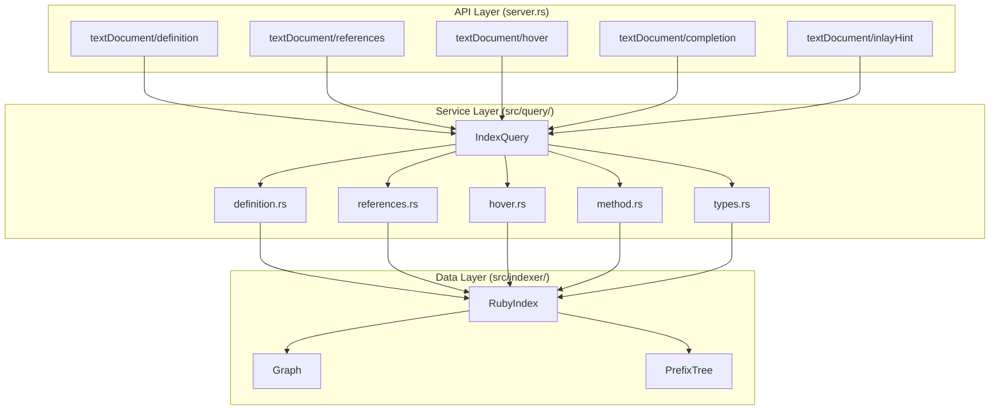

# Query Engine Design

## Overview

The Query Engine provides a unified service layer between LSP handlers (`server.rs`) and the data layer (`RubyIndex`). It consolidates all query logic into a single `src/query/` module, following a clean 3-layer architecture.

## Architecture Diagram



## Key Principle: Composable Helpers

Query helpers can **call each other** to build complex functionality. For example:


**Example: Method Completion Flow**
1. User types `user.` and requests completion
2. `get_completion()` calls `resolve_receiver_type("user")`
3. `resolve_receiver_type()` calls `find_definition()` to find `user`'s assignment
4. Find the assignment's return type via `get_method_return_type()`
5. Use result type to call `get_method_completions(User)`

This composability is why all helpers are on the same `IndexQuery` struct.

## Core Component: `IndexQuery`

```rust
// src/query/mod.rs
pub struct IndexQuery<'a> {
    index: &'a RubyIndex,
    uri: Option<&'a Url>,      // For file-scoped queries
    content: Option<&'a [u8]>, // For position-based analysis
}

impl<'a> IndexQuery<'a> {
    pub fn new(index: &'a RubyIndex) -> Self;
    pub fn for_file(index: &'a RubyIndex, uri: &'a Url, content: &'a [u8]) -> Self;
}
```

## Query Modules

### 1. Definition Query (`definition.rs`)

```rust
impl IndexQuery<'_> {
    fn find_definitions_at_position(&self, uri, position, content) -> Option<Vec<Location>>;
    fn find_constant_definitions_by_path(&self, path, ancestors) -> Option<Vec<Location>>;
    fn find_method_definitions_by_name(&self, method, ancestors) -> Option<Vec<Location>>;
    fn find_instance_variable_definitions(&self, name) -> Option<Vec<Location>>;
}
```

### 2. Reference Query (`references.rs`)

```rust
impl IndexQuery<'_> {
    fn find_references_at_position(&self, uri, position, content) -> Option<Vec<Location>>;
    fn find_constant_references(&self, fqn) -> Option<Vec<Location>>;
    fn find_variable_references(&self, fqn) -> Option<Vec<Location>>;
    fn find_method_references(&self, receiver, method, ancestors) -> Option<Vec<Location>>;
}
```

### 3. Type/Method Query (`method.rs`, `hover.rs`)

```rust
impl IndexQuery<'_> {
    // Method resolution
    fn get_method_return_type_from_index(&self, receiver_type, method_name) -> Option<RubyType>;
    fn find_method_at_position(&self, uri, position, method_name) -> Option<MethodInfo>;
    
    // Variable types
    fn get_instance_variable_type(&self, uri, name) -> Option<RubyType>;
    fn get_class_variable_type(&self, uri, name) -> Option<RubyType>;
    
    // Type checks
    fn is_module(&self, fqn) -> bool;
    fn is_class(&self, fqn) -> bool;
}
```

## Composability Examples

### Completion on Method Chain

```ruby
user = User.find(1)
user.profile.avatar_url  # Complete here
```

Query flow:
1. `resolve_receiver_type("user")` → find local var definition
2. `get_method_return_type(User, "profile")` → `Profile` 
3. `get_method_completions(Profile)` → return Profile's methods

### Hover on Chained Call

```ruby
user.orders.first.total_price
#              ↑ hover here
```

Query flow:
1. `resolve_receiver_type("user")` → `User`
2. `get_method_return_type(User, "orders")` → `Array[Order]`
3. `get_method_return_type(Array[Order], "first")` → `Order`
4. Display: `Order#first -> Order`

## Integration Strategy

| Capability | Uses IndexQuery For |
|------------|---------------------|
| `definitions/mod.rs` | Constants, variables |
| `definitions/method.rs` | Type-aware method resolution (complex) |
| `references.rs` | All reference lookups |
| `hover.rs` | Variable types, constant info |
| `completion/` | Method completions (future) |

## Files That Stay in Capabilities

- `definitions/method.rs` - Complex type-aware resolution with TypeNarrowing
- `definitions/variable.rs` - Local variables from document scope
- Thin adapter code in `definitions/mod.rs`
