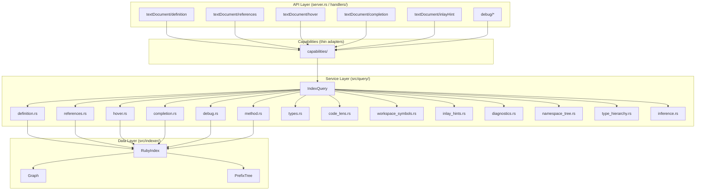

# Query Engine Design

## Overview

The Query Engine provides a unified service layer between LSP handlers (`server.rs`) and the data layer (`RubyIndex`). It consolidates all query logic into a single `src/query/` module, following a clean 3-layer architecture.

## Architecture Diagram


```mermaid
graph TB
    subgraph "API Layer (server.rs / handlers/)"
        TD[textDocument/definition]
        TR[textDocument/references]
        TH[textDocument/hover]
        TC[textDocument/completion]
        TI[textDocument/inlayHint]
        TDB[debug/*]
    end

    subgraph "Capabilities (thin adapters)"
        CAP[capabilities/]
    end

    subgraph "Service Layer (src/query/)"
        IQ[IndexQuery]
        DEF[definition.rs]
        REF[references.rs]
        HOV[hover.rs]
        COMP[completion.rs]
        DBG[debug.rs]
        METH[method.rs]
        TYPES[types.rs]
        CL[code_lens.rs]
        WS[workspace_symbols.rs]
        IH[inlay_hints.rs]
        DIAG[diagnostics.rs]
        NS[namespace_tree.rs]
        TH2[type_hierarchy.rs]
        INF[inference.rs]
    end

    subgraph "Data Layer (src/indexer/)"
        IDX[RubyIndex]
        GRAPH[Graph]
        PT[PrefixTree]
    end

    TD --> CAP
    TR --> CAP
    TH --> CAP
    TC --> CAP
    TI --> CAP
    TDB --> CAP

    CAP --> IQ

    IQ --> DEF
    IQ --> REF
    IQ --> HOV
    IQ --> COMP
    IQ --> DBG
    IQ --> METH
    IQ --> TYPES
    IQ --> CL
    IQ --> WS
    IQ --> IH
    IQ --> DIAG
    IQ --> NS
    IQ --> TH2
    IQ --> INF

    DEF --> IDX
    REF --> IDX
    HOV --> IDX
    COMP --> IDX
    DBG --> IDX
    METH --> IDX

    IDX --> GRAPH
    IDX --> PT
```

## Key Principle: Composable Helpers

Query helpers can **call each other** to build complex functionality. For example:


```mermaid
flowchart LR
    A[get_completion] --> B[resolve_receiver_type]
    B --> C[find_definition]
    C --> D[get_method_return_type]
    D --> E[get_method_completions]
```

**Example: Method Completion Flow**
1. User types `user.` and requests completion
2. `get_completion()` calls `resolve_receiver_type("user")`
3. `resolve_receiver_type()` calls `find_definition()` to find `user`'s assignment
4. Find the assignment's return type via `get_method_return_type()`
5. Use result type to call `get_method_completions(User)`

This composability is why all helpers are on the same `IndexQuery` struct.

## Core Component: `IndexQuery`

```rust
// src/query/mod.rs
pub struct IndexQuery<'a> {
    index: &'a RubyIndex,
    uri: Option<&'a Url>,      // For file-scoped queries
    content: Option<&'a [u8]>, // For position-based analysis
}

impl<'a> IndexQuery<'a> {
    pub fn new(index: &'a RubyIndex) -> Self;
    pub fn for_file(index: &'a RubyIndex, uri: &'a Url, content: &'a [u8]) -> Self;
}
```

## Query Modules (Implemented)

### 1. Definition Query (`definition.rs`)
Finds where symbols are defined (constants, methods, variables, YARD types).

### 2. Reference Query (`references.rs`)
Finds all usages of a symbol, with mixin-aware method reference searching.

### 3. Hover Query (`hover.rs`)
Gets type and documentation information for hover display.

### 4. Method Query (`method.rs`)
Resolves method calls, receivers, and return types via MRO.

### 5. Types Query (`types.rs`)
Type inference utilities for assignments and local variables.

### 6. Completion Query (`completion.rs`)
Constant completions (scope-resolved) and method completions (type-aware).

### 7. Debug Query (`debug.rs`)
Index inspection: lookup, stats, ancestors, methods, inference-stats, export-graph.

### 8. Code Lens Query (`code_lens.rs`)
Module mixin usage counts (include/prepend/extend/class).

### 9. Workspace Symbols Query (`workspace_symbols.rs`)
Symbol search with exact, prefix, camel case, and fuzzy matching.

### 10. Inlay Hints Query (`inlay_hints.rs`)
On-demand type inference for visible code ranges.

### 11. Diagnostics Query (`diagnostics.rs`)
YARD validation and unresolved constant/method diagnostics.

### 12. Namespace Tree Query (`namespace_tree.rs`)
Namespace tree structure for explorer views.

### 13. Type Hierarchy Query (`type_hierarchy.rs`)
Supertype and subtype navigation.

### 14. Inference Query (`inference.rs`)
Receiver, return type, and local variable resolvers.

## Composability Examples

### Completion on Method Chain

```ruby
user = User.find(1)
user.profile.avatar_url  # Complete here
```

Query flow:
1. `resolve_receiver_type("user")` → find local var definition
2. `get_method_return_type(User, "profile")` → `Profile` 
3. `get_method_completions(Profile)` → return Profile's methods

### Hover on Chained Call

```ruby
user.orders.first.total_price
#              ↑ hover here
```

Query flow:
1. `resolve_receiver_type("user")` → `User`
2. `get_method_return_type(User, "orders")` → `Array[Order]`
3. `get_method_return_type(Array[Order], "first")` → `Order`
4. Display: `Order#first -> Order`

## Integration Status

All capabilities now route through `IndexQuery`:

| Capability | Query Module | Status |
|------------|-------------|--------|
| `definitions/` | `query/definition.rs` | ✅ |
| `references.rs` | `query/references.rs` | ✅ |
| `hover.rs` | `query/hover.rs` | ✅ |
| `completion/` | `query/completion.rs` | ✅ |
| `diagnostics.rs` | `query/diagnostics.rs` | ✅ |
| `code_lens.rs` | `query/code_lens.rs` | ✅ |
| `workspace_symbols.rs` | `query/workspace_symbols.rs` | ✅ |
| `inlay_hints.rs` | `query/inlay_hints.rs` | ✅ |
| `namespace_tree.rs` | `query/namespace_tree.rs` | ✅ |
| `type_hierarchy.rs` | `query/type_hierarchy.rs` | ✅ |
| `debug.rs` | `query/debug.rs` | ✅ |

## Files That Stay in Capabilities (AST-only)

- `document_symbols.rs` — AST traversal, no index access
- `folding_range.rs` — AST traversal, no index access
- `formatting.rs` — Text manipulation, no index access
- `semantic_tokens.rs` — AST traversal, no index access
