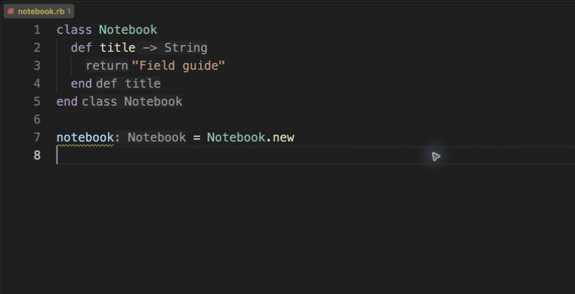

# Ruby Fast LSP

A Ruby language server written in Rust, with type-aware navigation, diagnostics,
and editor features for Ruby and ERB projects.

Navigate your project, complete method calls, rename symbols, and get feedback
as you edit. Explore type inference and Hash shapes for more detail about
the values in your code.



[Explore the feature guide](https://rajnaveen344.github.io/ruby-fast-lsp/) ·
[View this demo and its example](pages/public/demos/editing/completion/README.md)

The demo uses generic Ruby code with AI suggestions disabled. Playback pauses
are edited for readability; they are not latency measurements.

## Get started

**VS Code:** install [Ruby Fast LSP](https://marketplace.visualstudio.com/items?itemName=naveenraj.ruby-fast-lsp)
and open your project. An [Open VSX package](https://open-vsx.org/extension/naveenraj/ruby-fast-lsp)
is also available for compatible editors.

**Other LSP clients:** install the server and configure your client to launch it
with `--stdio` and language ID `ruby`:

```sh
npm install -g @ruby-fast/lsp
ruby-fast-lsp --stdio
```

**Build from source:** use the repository's pinned Rust toolchain:

```sh
cargo build --locked --release --bin ruby-fast-lsp
./target/release/ruby-fast-lsp --stdio
```

See [usage and support boundaries](docs/usage.md) for runtime selection,
formatting, templates, framework integrations, and troubleshooting. Package
availability does not certify every runtime or platform combination; release
acceptance is tracked for each candidate through the [release checklist](docs/development/release.md).

## What it does

- Go to definition, references, implementation, rename, and call/type hierarchies.
- Completion, signature help, hover, compact type hints, and symbol search.
- Syntax and semantic diagnostics that follow edits and cross-file definitions.
- Type inference from Ruby bodies, YARD, and RBS, including structural Hash
  shapes, collection blocks, and supported lambda/proc calls.
- Isolated indexing for multiple Ruby projects, exact runtime/dependency
  selection, and JRuby Java navigation.
- Ruby analysis in ERB, optional RuboCop/Standard linting and formatting, and
  bundled Rails, RSpec, Minitest, Sinatra, and Cucumber integrations.

Inference is conservative: unsupported dynamic behavior or incomplete evidence
remains `Unknown`. The [feature contracts](docs/README.md#feature-contracts)
describe supported forms and limits.

## Explore the code

| Path | Purpose |
| --- | --- |
| [src/](src/ARCHITECTURE.md) | Server, workspace lifecycle, and LSP adapters; start at `src/main.rs` and `src/server.rs` |
| [crates/ruby-analysis/](crates/ruby-analysis/README.md) | Shared facts, indexing, inference, and semantic queries |
| [crates/](Cargo.toml) | RBS/JVM support, extension APIs and hosts, and the external LSP test harness |
| [extensions/](extensions/README.md) | Framework integrations and extension examples |
| [editors/](editors/README.md) | Editor adapters and npm/VSIX packaging |
| [src/test/](src/test/README.md) | Feature and CLI tests, lifecycle simulation, and shared fixtures |
| [docs/](docs/README.md) / [support/](support/README.md) | Maintained guides / validation tools, assets, and evidence |

## Next priorities

- Improve proof coverage for user-defined yielding methods and additional RBS
  forms, guided by reduced real-world regressions.
- Consolidate repeated argument/type binding logic and make unexplained
  `Unknown` outcomes easier to investigate.
- Refine dependency-driven invalidation so cross-file refresh stays correct
  without unnecessary work during editing.
- Expand independent simulator expectations and native/editor acceptance before
  broader public promotion.

These are directions, not delivery promises. Completed implementation plans
and old progress logs live in Git history; this README is the current roadmap.

## Contribute

Start with the [contributor guide](AGENTS.md) and [test guide](src/test/README.md).
Use small, generic reproductions when reporting or fixing a bug.

```sh
cargo test --locked --workspace
python3 -B support/structure/check.py
```

The [performance guide](docs/development/performance.md) explains when and how
to measure a change. Issues and contributions are welcome on
[GitHub](https://github.com/rajnaveen344/ruby-fast-lsp).

MIT licensed. See [license](editors/vscode/vsix/LICENSE).
