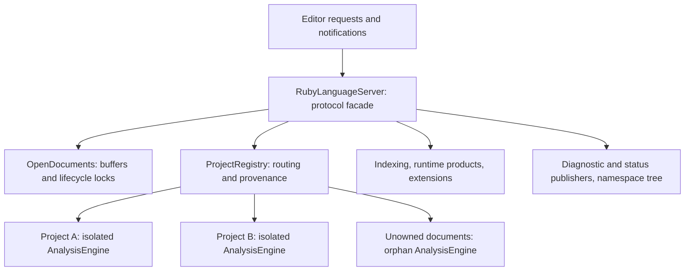

# Server state ownership

`RubyLanguageServer` groups protocol state into owners with separate lifetimes
and locks. The semantic database remains isolated per Ruby project.

Start with [server.rs](../../src/server.rs): it constructs the owners and implements
the LSP protocol facade. Each module under `src/server/` keeps related state and
operations together. The semantic database remains
[AnalysisEngine](../../crates/ruby-analysis/src/engine/state/mod.rs), isolated per Ruby
project, with a separate orphan engine for unowned documents.

## The ten server fields

| Field | Responsibility | Where to read next |
| --- | --- | --- |
| `client` | Outbound LSP notifications, registration, and refresh requests. | Protocol methods in `server.rs`. |
| `config` | One shared accepted server configuration. | `config/` and initialization handlers. |
| `documents` | Open buffers, versions, document handles, and per-URI lifecycle locks. | [documents.rs](../../src/server/documents.rs) |
| `projects` | Longest-root routing, isolated project engines, orphan engine, and retained external-document provenance. | [projects.rs](../../src/server/projects.rs) |
| `indexing` | Project scheduler, resource governor, and sequenced status publication. | [indexing.rs](../../src/server/indexing.rs) |
| `products` | Runtime discovery and shared immutable dependency products. | [products.rs](../../src/server/products.rs) |
| `extensions` | Extension registry and dynamic watcher registration lifecycle. | [extensions.rs](../../src/server/extensions.rs) |
| `diagnostics` | Latest-per-URI outbound queue and exact-source retained linter output. | [diagnostics.rs](../../src/server/diagnostics.rs) |
| `file_changes` | Latest filesystem events and debounce generation. | [watched_files.rs](../../src/server/watched_files.rs) |
| `namespace_tree` | Cached Ruby Index projection and debounced invalidation. | [namespace_tree.rs](../../src/server/namespace_tree.rs) |

No facade field is public outside the crate. Fields used by sibling modules
are explicitly `pub(crate)`; server-owned fields are explicitly `pub(self)`.
This keeps the declaration visually consistent without widening access. Separate
executables use server operations instead of replacing internal state bags.

Separate executable targets use operations such as `configuration_snapshot()`,
`configure_embedded()`, `register_indexing_run()`, and
`runtime_product_snapshot()`. Configuration and telemetry snapshots are detached
values, with no shared locks or cache handles. The two product snapshot structs
are temporary reports, not additional stored server state. Startup policy methods
require mutable access and must be called before starting work or sharing the
server. Normal LSP configuration continues through the existing handlers.

The standalone file-open profiler's low-level document instrumentation lives in
`src/perf/file_open.rs`; its executable retains the DHAT allocator and entry point.
This preserves the measurement path without exposing document-cache mutation to
other crates. The profiler's existing output schema and counter fields remain
unchanged.

## The smaller structs

Field counts below count direct production fields, including shared handles;
they are not counts of allocations or independent copies of state.

| Owner | Fields | Contents |
| --- | ---: | --- |
| `OpenDocuments` | 2 | Buffer map and weak per-document semantic locks. |
| `ProjectRegistry` | 3 | Projects, orphan engine, external-document provenance. |
| `Workspace` | 9 | Root URI/path, indexing status, engine, runtime, extension context, navigation demand, require resolution, owning editor folders. |
| `ProjectRuntimeState` | 4 | Selected runtime, Ruby version, classpath fingerprint, JRuby import provider. |
| `DependencyRequireState` | 2 | Require roots and their feature index. |
| `IndexingServices` | 3 | Scheduler, resource governor, status publisher. |
| `IndexingStatusPublisher` | 4 | Sequence, publication state, worker wakeup, runtime handle. |
| `IndexingStatusPublicationState` | 5 | Last/pending snapshots and sender/counter-flush state. |
| `RuntimeProducts` | 8 | Discovery, six product caches, binding counters. |
| `ExtensionServices` | 3 | Registry, client capability, current registration. |
| `DiagnosticPublisher` | 1 | Shared diagnostic publication state. |
| `DiagnosticPublicationState` | 3 | Pending diagnostics, sender state, retained linter output. |
| `WatchedFileChanges` / its batch | 1 / 2 | Shared batch / generation and events. |
| `NamespaceTreeCache` | 2 | Cached response and invalidation timer. |

The owners expose operations and typed handles instead of allowing callers to
replace their internal maps. `OpenDocumentView` deliberately retains the original
map lock while callers read document handles. Project runtime accessors preserve
the existing independent locks. This refactor does not introduce a global mutex
or combine state transitions that previously happened independently.

## Lifetimes and construction

Open buffers retain text, versions, and source mapping separately from engine
facts. Cache location is an immutable construction input, so tests can use
isolated directories without a mutable test-only override. Normal LSP startup
defers extension discovery until initialization; embedded constructors preserve
their documented setup behavior.

Completion holds the document's semantic lock while reading its source, local
scopes, and engine results. Accepted open/change operations finish replacing
that state before completion returns a candidate list for the editor to reuse.

Server clones share document locks, registries, publishers, schedulers, resource
admission, and cache handles. They do not copy project databases. Delayed require
refresh still holds the document, project-ownership, dependency-index, and engine
identity guards through its conditional commit and synchronous publication.

Cache policies remain unchanged: core templates are bounded at eight entries /
128 MiB estimated weight; runtime paths at 32 / 1 MiB; classpath-file metadata at
4,096 / 16 MiB; Java artifacts at 256 / 256 MiB. Gem dependency single-flight
products remain ephemeral. These independent retention ceilings are not a
measured total process memory budget.

## Tests follow production paths

There is no generic test-state bag and no test-only field on the server facade.
Three narrow fields remain under their actual owners, only in test builds:

| Field | Why it remains |
| --- | --- |
| `IndexingServices::schedule` | Pauses real collection, commit, and publication boundaries to force deterministic races. |
| `IndexingServices::progress_reports` | Records worker progress before generation filtering, so reporting and accepted client status can be checked separately. |
| `DiagnosticPublisher::submitted` | Synchronous observation for paused-race and inline assertions while production identity guards are held. It does not stand in for delivery. |

`FakeEditor` now initializes an ordinary `LspService` and consumes its real
`ClientSocket`. Its asynchronous `diagnostics()` helper waits for the latest
submitted value to arrive as a serialized `textDocument/publishDiagnostics`
notification. Missing delivery cannot satisfy an empty-clear assertion. The
harness reader acknowledges refresh/registration requests without performing
analysis or changing semantic state.

`published_diagnostics()` and inline diagnostic tags still observe synchronous
submission. Lifecycle and query helpers still invoke production handlers directly;
workspace fixture registration can also be direct. This is not an installed VS
Code test or full inbound transport test. The separate external LSP/package
harness provides complementary coverage and remains separate to avoid a crate
dependency cycle.

## Where to verify ownership changes

Use the tests beside [server.rs](../../src/server.rs) for shared clone identity,
project isolation, construction, cache reuse, and outbound diagnostic delivery.
The [test guide](../../src/test/README.md) explains harness boundaries, and the
[simulation guide](simulation.md) explains controlled schedule coverage. These
checks provide evidence for exercised behavior, not proof that every future
ownership or scheduling defect will be caught.
