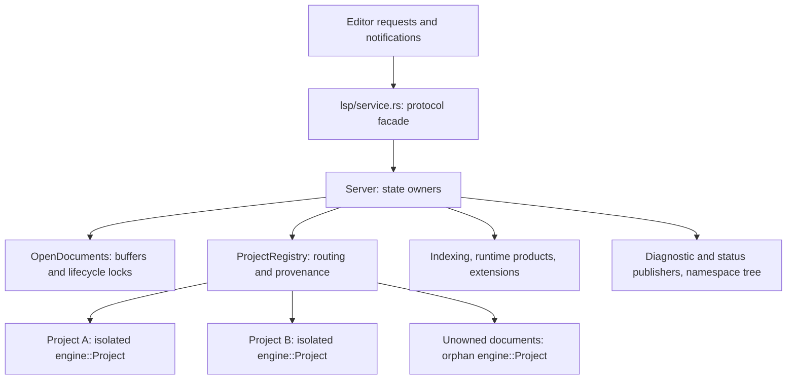

# Server state ownership

`Server` groups protocol state into owners with separate lifetimes
and locks. The semantic database remains isolated per Ruby project.

Start with [server.rs](../../src/server/mod.rs): it constructs the owners. The LSP
protocol facade (`impl LanguageServer` and the debug and namespace-tree custom
requests) lives in [service.rs](../../src/lsp/service.rs) and routes to
[feature](../../src/features/README.md) `handle` functions and the lifecycle
handlers; the server keeps state and state operations only and imports neither
`crate::lsp` nor `crate::features`. The cached namespace-tree response is the engine's
`NamespaceTreeResponse`; the request parameters stay with the namespace-tree feature. Each module under `src/server/` keeps related state and
operations together. The semantic database remains
[Project](../../crates/ruby-analysis/src/engine/state/mod.rs), isolated per Ruby
project, with a separate orphan project for unowned documents.

Each project's engine is reached only through a
[`ProjectHandle`](../../src/server/projects/handle.rs). Readers call
`view(|view| ..)`, which holds the engine read guard for one synchronous
closure, so an answer reflects one semantic revision and no guard crosses an
`.await`. Lifecycle writes use named operations (`register_source`, `remove_path`, `remove_path_of_kind`, `clear_path_facts_of_kind`, `resolve`, `reset`, and `refresh_require_diagnostics_if_snapshot`, which replaces a file's unresolved-require diagnostics only while its source snapshot is current and publishes under the same write guard); `update(|engine| ..)` remains for fixtures and tools. Handles are compared with
`is_same`. The server routes with `project_for_uri`, `projects`, and
`orphan_project`. The loader reaches a project through
`ProjectHandle::load_target`, an `Arc<dyn LoadTarget>` returned by
`LoadSink::target_for_uri` or fixed by `IndexingCoordinator::set_load_target`.
`LoadTarget` is defined in `src/loader/context/target.rs`; the handle
implements its read and write primitives over the engine lock, and the loader
calls only the named operations built on them (fact replacement, conditional
snapshot commits, registration, extension seeds, gem binding, resolve, and
compaction). `is_target` tells whether a target is this project.

## The ten server fields

| Field | Responsibility | Where to read next |
| --- | --- | --- |
| `client` | Outbound LSP notifications, registration, and refresh requests. | Protocol methods in [service.rs](../../src/lsp/service.rs). |
| `config` | One shared accepted server configuration. | `environment/config/` and initialization handlers. |
| `documents` | Open buffers, versions, document handles, and per-URI lifecycle locks. | [documents.rs](../../src/server/documents.rs) |
| `projects` | Longest-root routing, isolated project handles, orphan project, and retained external-document provenance. | [projects](../../src/server/projects/mod.rs), [load sink](../../src/server/projects/load_sink.rs) |
| `indexing` | Project scheduler, resource governor, and sequenced status publication. | [indexing.rs](../../src/server/indexing.rs) |
| `products` | Runtime discovery, shared immutable dependency products, and the `runtime/status` projection (`ProjectRuntimeStatus`). | [products.rs](../../src/server/products.rs) |
| `extensions` | Extension registry and dynamic watcher registration lifecycle. | [extensions.rs](../../src/server/extensions.rs) |
| `diagnostics` | Latest-per-URI outbound queue, exact-source retained linter output, the single engine diagnostic projection (`engine_diagnostics`, a free function over one `&View`; one URI check per file, ranges through `utils::lsp::lsp_file_range`), the one composition of a published document (`compose_diagnostics`: syntax, then engine facts, then linter output retained for the exact current source, all through one view whose engine guard is held through enqueue; `publish_document_diagnostics` takes that guard), the dependency-root `unresolved-require` refresh (its code is the engine's `UNRESOLVED_REQUIRE_CODE`), and open-project diagnostic publication after a load. | [diagnostics.rs](../../src/server/diagnostics.rs) |
| `file_changes` | Latest filesystem events and debounce generation. | [watched_files.rs](../../src/server/watched_files.rs) |
| `namespace_tree` | Cached Ruby Index projection and debounced invalidation. | [namespace_tree.rs](../../src/server/namespace_tree.rs) |

### What stays on the server and why

Per-project state lives in the project registry: the handle owns the engine,
runtime state, and published requires, and `Workspace` keeps the routing root,
indexing status, extension context seed, navigation demand, and editor folders.
The six fields besides `client`, `config`, `documents`, and `projects` are
server-wide by design. `indexing` admits work for every project through one
scheduler and one CPU/memory/I/O governor, so a per-project copy would defeat
the budget. `products` holds bounded immutable products shared across
projects, which the isolation rules allow. `extensions` is one registry loaded
from configuration and workspace trust, with one dynamic watcher registration.
`diagnostics` is the single outbound diagnostic queue for the client, so
publication stays latest-per-URI across projects. `file_changes` debounces the
client's watcher events before they are routed to projects. `namespace_tree`
caches one response for the whole Ruby Index view. The six server-wide
services stay direct fields rather than one `services` group: each has its own
lock and lifetime, and a grouping field would only add a hop to every access.

Every server field is `pub(self)`, private to `src/server/`. Features and
lifecycle handlers call named operations for what they need instead of reaching
through an owner; the fields with operations outside `src/server/` are:

| Field | Operations outside `src/server/` |
| --- | --- |
| `client` | `client()`: the editor connection, absent for an embedded server |
| `products` | none; load contexts carry `SharedProducts`, and tests observe reuse through `shared_products()` |
| `documents` | `open_document`, `open_document_content`, `get_doc`, `is_document_open`, `open_documents` (a read-only view), `update_open_document`, `close_open_document` |
| `config` | `configuration_snapshot()` (a copy), `with_configuration` (read one part), `replace_configuration` (accept a whole configuration); tests also use `update_configuration` |
| `extensions` | `extension_registry()` (the shared registry handle), `reconfigure_extensions` (governed reload for the current roots), `set_extension_watch_dynamic_registration`, `refresh_extension_watch_registration` (the watched-file registration state stays private) |
| `indexing` | `indexing_resources()` (the shared admission governor), `indexing_resource_snapshot`, `register_indexing_run` (whose admission is awaited with `wait()`), `set_indexing_resource_policy` and `set_indexing_concurrency` before the server is shared; tests also use `indexing_scheduler()` and `test_schedule()` |

Separate executables use server operations instead of replacing internal
state bags.

The loader never sees the server. For each project load and interactive file
pass the server builds a `LoadContext` of shared handles (configuration, require
roots, open sources, products, governor) and passes only that. The loader writes
through the context's `LoadSink`, which the server implements in the
[load sink](../../src/server/projects/load_sink.rs) by delegating to the owners
above. When a project's facts are resolved the loader calls
`LoadSink::project_facts_ready`; the server then publishes diagnostics for the
project's open documents from `diagnostics.rs` and reports whether the indexing
run is still current. The extension registry only produces the extension
semantic seed; the loader commits it to the project engine through
`LoadTarget::commit_extension_seed`. After `reset` empties an engine during a
runtime rebuild, the server calls the registry's `forget_semantic_seed` so the
rebuild seeds the engine again.

An interactive file pass (didOpen, didChange, didSave, open-document refreshes
after a dependency change, and embedded `open_embedded_document`) calls
`FileProcessor::analyze_file*`, which returns an uncommitted `LoadedFile`, and
commits it with `LoadedFile::commit` in the same admitted task before any
diagnostics are read. The commit replaces the file's facts, resolves them, and
retains the processed document in `documents` through
`LoadSink::mark_document_indexed`.

A file leaves its project through `Project::remove`: a closed file that is
deleted or falls outside the source policy, a closed excluded document, and a
rehomed open document in every project except its new owner. Other files stop
resolving into it, a deleted closed file is published an empty diagnostic
clear, and its id is never reused. A file that still exists but cannot be read
or parsed stays registered with no facts, so require resolution still finds it.

Separate executable targets use operations such as `configuration_snapshot()`,
`configure_embedded()`, `register_indexing_run()`, and
`runtime_product_snapshot()`. Configuration and telemetry snapshots are detached
values, with no shared locks or cache handles. The two product snapshot structs
are temporary reports, not additional stored server state. Startup policy methods
require mutable access and must be called before starting work or sharing the
server. Normal LSP configuration continues through the existing handlers.

The standalone file-open profiler lives in `crates/devtools`. It drives open
buffers only through `open_embedded_document` and `close_embedded_document`, which
store or drop a buffer and run the current-file pass without notifications, so
the document cache itself stays private to the server. The profiler's output
schema and counter fields remain unchanged.

```mermaid
flowchart TD
    LSP[Editor requests and notifications] --> Service[lsp/service.rs: protocol facade] --> Server[Server: state owners]
    Server --> Documents[OpenDocuments: buffers and lifecycle locks]
    Server --> Projects[ProjectRegistry: routing and provenance]
    Projects --> A[Project A: isolated engine::Project]
    Projects --> B[Project B: isolated engine::Project]
    Projects --> Orphan[Unowned documents: orphan engine::Project]
    Server --> Services[Indexing, runtime products, extensions]
    Server --> Output[Diagnostic and status publishers, namespace tree]
```

## The smaller structs

Field counts below count direct production fields, including shared handles;
they are not counts of allocations or independent copies of state.

| Owner | Fields | Contents |
| --- | ---: | --- |
| `OpenDocuments` | 2 | Buffer map and weak per-document semantic locks. |
| `ProjectRegistry` | 3 | Projects, orphan project handle, external-document provenance. |
| `Workspace` | 7 | Root URI/path, indexing status, project handle (`handle()`), extension context, navigation demand, owning editor folders. |
| `ProjectHandle` | 3 | Engine lock, runtime state (`runtime()`), and published requires (`dependency_require_paths`, `require_feature_index`). Each has its own lock; neither runtime nor requires is held under the engine guard. |
| `ProjectRuntimeState` | 3 | Selected runtime, Ruby version, JRuby add-on (`loader::jruby_add_on::JrubyAddOn`; the classpath fingerprint is read from it). Defined in [runtime.rs](../../src/server/projects/runtime.rs). |
| `PublishedRequires` | 2 | Require roots and their feature index (`loader::context`), which loads of the project read live. |
| `IndexingServices` | 3 | Scheduler, resource governor, status publisher. |
| `IndexingStatusPublisher` | 4 | Sequence, publication state, worker wakeup, runtime handle. |
| `IndexingStatusPublicationState` | 5 | Last/pending snapshots and sender/counter-flush state. |
| `RuntimeProducts` | 8 | Discovery, six product caches, binding counters. |
| `ExtensionServices` | 3 | Registry, client capability, current registration. |
| `DiagnosticPublisher` | 1 | Shared diagnostic publication state. |
| `DiagnosticPublicationState` | 3 | Pending diagnostics, sender state, retained linter output. |
| `WatchedFileChanges` / its batch | 1 / 2 | Shared batch / generation and events. |
| `NamespaceTreeCache` | 2 | Cached response and invalidation timer. |

The owners expose operations and typed handles instead of allowing callers to
replace their internal maps. `OpenDocumentView` deliberately retains the original
map lock while callers read document handles. Project runtime accessors preserve
the existing independent locks. This refactor does not introduce a global mutex
or combine state transitions that previously happened independently.

## Lifetimes and construction

Open buffers retain text, versions, and source mapping separately from engine
facts. Cache location is an immutable construction input, so tests can use
isolated directories without a mutable test-only override. Normal LSP startup
defers extension discovery until initialization; embedded constructors preserve
their documented setup behavior.

Completion holds the document's semantic lock while reading its source, local
scopes, and engine results. Accepted open/change operations finish replacing
that state before completion returns a candidate list for the editor to reuse.

Server clones share document locks, registries, publishers, schedulers, resource
admission, and cache handles. They do not copy project databases. Delayed require
refresh still holds the document, project-ownership, dependency-index, and engine
identity guards through its conditional commit and synchronous publication.

Cache policies remain unchanged: core templates are bounded at eight entries /
128 MiB estimated weight; runtime paths at 32 / 1 MiB; classpath-file metadata at
4,096 / 16 MiB; Java artifacts at 256 / 256 MiB. Gem dependency single-flight
products remain ephemeral. These independent retention ceilings are not a
measured total process memory budget.

## Tests follow production paths

There is no generic test-state bag and no test-only field on the server.
Three narrow fields remain under their actual owners, only in test builds:

| Field | Why it remains |
| --- | --- |
| `IndexingServices::schedule` | Pauses real collection, commit, and publication boundaries to force deterministic races. |
| `IndexingServices::progress_reports` | Records worker progress before generation filtering, so reporting and accepted client status can be checked separately. |
| `DiagnosticPublisher::submitted` | Synchronous observation for paused-race and inline assertions while production identity guards are held. It does not stand in for delivery. |

`FakeEditor` now initializes an ordinary `LspService` and consumes its real
`ClientSocket`. Its asynchronous `diagnostics()` helper waits for the latest
submitted value to arrive as a serialized `textDocument/publishDiagnostics`
notification. Missing delivery cannot satisfy an empty-clear assertion. The
harness reader acknowledges refresh/registration requests without performing
analysis or changing semantic state.

`published_diagnostics()` and inline diagnostic tags still observe synchronous
submission. Lifecycle and query helpers still invoke production handlers directly;
workspace fixture registration can also be direct. This is not an installed VS
Code test or full inbound transport test. The separate external LSP/package
harness provides complementary coverage and remains separate to avoid a crate
dependency cycle.

## Where to verify ownership changes

Use the tests beside [server.rs](../../src/server/mod.rs) for shared clone identity,
project isolation, construction, cache reuse, and outbound diagnostic delivery.
The [test guide](../../src/test/README.md) explains harness boundaries and
controlled schedule coverage. These
checks provide evidence for exercised behavior, not proof that every future
ownership or scheduling defect will be caught.
