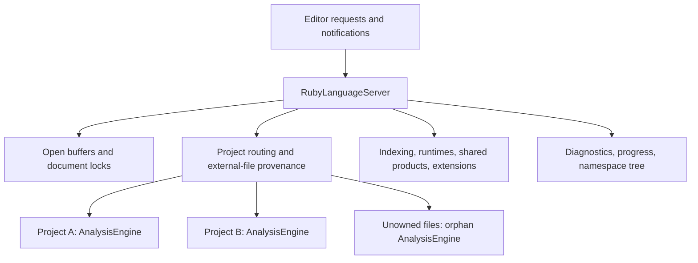

# RubyLanguageServer state audit

Reviewed against the working tree on 2026-09-10. This is a design and usage
audit; it does not change production code or claim measured memory savings.

`RubyLanguageServer` currently has **30 production fields and four test-only
fields**. Two production fields have no consuming reads in this repository.
Most of the remaining fields support real behavior, but their ownership is
hard to see because they are exposed together on the server.

The server is created by `LspService::build` in [main.rs](../src/main.rs).
[server.rs](../src/server.rs) wires the protocol handlers to project routing,
open documents, background services, and publication. The semantic database
is [AnalysisEngine](../crates/ruby-analysis/src/engine/state.rs), owned separately
by each project and by the orphan-file context.

## What each field does

The proposed owners below describe responsibilities, not a requirement to
create one new wrapper for every row. Existing cohesive state objects can
simply move to a focused module with their behavior.

| Field | Why it exists / what consumes it | Cleanup disposition |
| --- | --- | --- |
| `client` | Outbound LSP responses, notifications, dynamic registration, and refresh requests. `None` supports embedded and test servers. | Keep on the protocol facade. |
| `config` | Accepted runtime, indexing, tool, and extension configuration read by initialization, handlers, and coordinators. | Keep one authoritative configuration handle; avoid copying mutable configuration into new owners. |
| `workspaces` | Registered Ruby projects and their isolated engines. Longest-root routing selects the owner; workspace queries aggregate projects. | Group in project routing. The current comment says “workspace folders,” but entries represent Ruby project roots. |
| `docs` | Current open-buffer content, versions, source-coordinate mapping, embedded-Ruby projection, and local scope information. | Group in open documents. These buffers cannot be replaced by engine facts. |
| `document_semantic_locks` | Per-URI async serialization for open/change/close and delayed semantic publication. Weak references allow unused locks to be reclaimed. | Keep with open documents; preserve shared lock identity across server clones. |
| `analysis_engine` | Engine for unowned/orphan files, including seeded universal core constants. Project facts belong to each workspace's engine instead. | Rename to `orphan_engine`, then group in project routing. Do not remove it as a duplicate project DB. |
| `external_document_projects` | Remembers which project produced navigation into a dependency file. Stores project root URIs so removed projects do not remain alive through this map. | Keep with project routing and its close/removal cleanup. |
| `discovered_runtimes` | One process-local discovery result shared by runtime commands and exact project runtime selection. | Group with runtime/dependency services; preserve the one-time discovery policy. |
| `extension_registry` | Shared loaded Wasm extension hosts, extension lifecycle, status, and response hooks. Each project still receives its own semantic facts. | Group with extension lifecycle and watcher registration. |
| `indexing_scheduler` | Chooses which project generation runs next; tracks active-project priority, queued work, and cancellation. | Keep as the scheduler within indexing services. |
| `indexing_resources` | Admits actual work under CPU, memory, task, and I/O limits, including interactive and external-tool work. | Keep the process-wide governor. It has a different job from the project scheduler. |
| `core_engine_cache` | Reuses immutable core-engine templates while projects bind into separate engines. | Group in shared products; preserve the eight-entry / 128 MiB estimated-weight limits. |
| `runtime_stdlib_path_cache` | Reuses exact runtime load-path probes keyed by executable identity and Java home. | Group in shared products; preserve the 32-entry / 1 MiB estimated-weight limits and identity revalidation. |
| `gem_dependency_cache` | Coalesces concurrent requests for the same immutable gem product. Completed products are not retained after their consumers finish. | Group in shared products; keep its ephemeral retention policy. |
| `classpath_file_product_cache` | Reuses file checksums and bounded manifest metadata without retaining raw JAR bytes or project classpath precedence. | Group in shared products; preserve the 4,096-entry / 16 MiB estimated-weight limits. |
| `java_artifact_product_cache` | Reuses parsed immutable class metadata. Each project composes its own ordered Java catalog and facts. | Group in shared products; preserve the 256-entry / 256 MiB estimated-weight limits. |
| `persistent_derived_product_cache` | Handle, accounting, and counters for disk-backed gem, Java, and compiled-Wasm products. | Group in shared products. It is not another live semantic database. |
| `gem_dependency_binding_counters` | Records validation and insertion work when shared gem products bind into isolated engines. Used by status/profiling evidence. | Keep with product/binding telemetry; this measures a different stage from cache hit counters. |
| `indexing_status_sequence` | Monotonic ordering for snapshots sent by this server process. | Group in an indexing status publisher. |
| `indexing_status_publication` | Latest/pending snapshots, a dedicated sender, and counter coalescing to avoid blocking LSP traffic. | Keep its state machine with the status publisher. |
| `indexing_status_wakeup` | Coalesces progress-triggered wakeups from workers while preserving a later update arriving during publication. | Keep with the status publisher; it is distinct from an outbound sender being scheduled. |
| `tokio_handle` | Lets indexing workers schedule publication when the current worker thread has no Tokio runtime handle. | Move with the status publisher; removing it can lose worker-originated progress. |
| `diagnostic_publication` | Latest diagnostics per URI, one outbound sender, and exact-source retained linter output for semantic-only refreshes. | Already grouped. Move its behavior into a diagnostics module before considering a different representation. |
| `watched_file_changes` | Latest filesystem event per URI plus a debounce generation. Shutdown invalidates pending batches. | Already grouped. Keep separate from open-buffer `didChange` ownership. |
| `extension_watch_dynamic_registration` | Whether this client supports dynamic watcher registration. | Group with extension watcher registration. |
| `extension_watch_registration` | The currently registered watcher patterns and serialization across unregister/register operations. | Group with extension watcher registration; the capability flag and current registration are distinct state. |
| `namespace_tree_cache` | One cached Ruby Index response, keyed by a request/project-derived hash and the engine's tree hash. | Group with namespace-tree behavior. It is an editor projection cache, not semantic truth. |
| `cache_invalidation_timer` | Debounces explicit namespace-tree invalidation after indexing/edit lifecycle updates. | Keep with the tree cache initially. Audit hash coverage and lifecycle tests before removing the timer. |
| `reindex_timer` | Declared and initialized twice; no reads, writes, or consumers after construction were found. | Remove. The actual edit and watched-file paths do not use this timer. |
| `parent_process_id` | Assigned in `set_parent_process_id`, but never read. The live monitor captures the method's PID argument directly. | Remove the stored value and its assignment; preserve monitor startup and the existing monitor task. |

The cache limits above are separate retention ceilings, not a measured process
memory total. The governor's transient-work budget, live project-engine memory,
and retained shared products account for different allocations.

All four fields below use `#[cfg(test)]` and do not contribute to the production
server's state layout. A generic `test_state` wrapper was considered, but it
would group unrelated responsibilities and is not the recommended target:

| Test-only field | Purpose | Cleanup disposition |
| --- | --- | --- |
| `published_diagnostics` | Records diagnostic submissions, including explicit empty clears, before the outbound queue/client check. | Preserve current assertions until harness capture from the real outbound stream provides equivalent coverage. |
| `test_schedule` | Pauses real collection/commit/publication boundaries for deterministic interleavings. | Retain narrowly scoped instrumentation; do not move gates away from their production boundaries. |
| `user_cache_root_override` | Isolates generated/cache files during tests. | Prefer an ordinary internal construction input for cache location, selected by the harness; avoid a separate test-only cache implementation. |
| `indexing_progress_reports` | Records worker progress calls before generation validation and client publication. | Keep per-file reporting assertions distinct from assertions about accepted or delivered status messages. |

`FakeEditor` uses real document handlers and the real analysis engine, but its
default server has no LSP client. Its diagnostic recorder therefore observes
submission while bypassing the outbound queue, sender, serialization, and
transport. Registration helpers can also call server operations directly.
These are in-process lifecycle tests, not full installed-product acceptance.
Existing tests with a real LSP service/socket and the black-box package harness
provide complementary coverage.

The preferred direction is to let the harness observe normal outbound messages
and supply ordinary construction inputs, while preserving the minimal scheduling
hooks needed to force rare interleavings. Keep assertion state in the harness
where possible. Do not remove the existing intermediate-state assertions merely
to make the server struct look cleaner, and do not merge the root harness with
the external harness that depends on the root crate.

## Why the apparently duplicated state remains useful

`docs` owns the editor's current text and version. The engine owns file-indexed
facts used across open and closed files. Unsaved text and reusable semantic
facts have different lifetimes and consumers. Removing the document cache
would lose information required by parsing, source-coordinate conversion, and
editing; deleting engine facts would break cross-file analysis.

Each `Workspace` currently has 13 fields covering project identity, its engine,
indexing generation/readiness, selected runtime and JRuby provider, extension
context, require resolution, and owning editor folders. These project-specific
values must remain isolated even when immutable dependency products are shared.

Inside `AnalysisEngine`, the database is already divided into `SourceRegistry`,
`NameRegistry`, `FactArena`, and `SemanticGraph`, with file-owned inference
evidence, source/semantic revisions, and derived lookup caches. Candidate and
resolved reference/diagnostic stores are deliberate: candidates must survive
long enough to resolve again when dependencies change. This audit does not
establish that those stores are redundant.

Cloning `RubyLanguageServer` currently shares its state through `Arc` and
shared-handle implementations; it does not clone the project's semantic DB.
Moving fields into smaller structs must preserve this property. Do not replace
shared handles with independently cloned maps, engines, schedulers, or caches.

## Suggested cleanup sequence

1. **Remove only the two unused stored fields.** Keep parent monitoring intact.
   Rename `analysis_engine` to `orphan_engine` and correct the `workspaces`
   comment to make the existing ownership obvious. These are source cleanup
   changes, not an expected material memory optimization.
2. **Consolidate common construction.** `new(client)` and `Default` initialize
   nearly the same field list. Preserve their deliberate difference:
   `new(client)` starts with an empty extension registry and defers discovery
   to initialization; `Default` builds a registry from the environment for
   embedded/test use. A shared initializer must make that choice explicit.
3. **Extract the status publisher.** Move its four fields and existing
   observe/sequence/coalesce/send behavior together. Keep lock order, atomic
   operations, worker-runtime scheduling, and wire sequencing unchanged.
4. **Group runtime/dependency products.** Put the existing handles, discovery,
   and reuse telemetry under one clear owner. Retain exact cache identities,
   limits, producer lifetimes, and project-specific binding.
5. **Encapsulate documents and project routing.** Move behavior with state:
   document locking, lookup, source authority, longest-root routing, external
   provenance, and removal cleanup. Replace direct external map access with
   narrow operations as each caller migrates. This is the more sensitive step.
6. **Review representation changes separately.** Namespace-tree cache identity,
   timer removal, source retention, and engine-store deduplication each need
   their own evidence. A smaller facade alone does not prove lower memory use.

Keep `client` and configuration explicit on the server. Leave cohesive objects
such as the diagnostic publication state and watcher batch intact during the
first extractions. Avoid creating a single large mutex around all new groups;
the existing independent locks allow unrelated requests and background work to
proceed concurrently.

## How much protection the tests provide

The last completed workspace run for the dependency-refresh fix had **2,541
passing tests, zero failures, and three explicit scale/corpus deferrals**. See
[the verification record](../support/performance/dependency-refresh-races-2026-09-10.json).
No tests or performance runs were repeated for this read-only code audit.

That is useful protection for incremental refactoring, not evidence that every
future ownership or scheduling error will be caught. The tests cover different
layers:

| Refactor risk | Existing evidence | Additional focus if that behavior changes |
| --- | --- | --- |
| Newer edits overwritten by background work | Actual coordinator and dependency-refresh schedules in `src/test/simulation/production_schedules.rs` and `dependency_refresh.rs`. | Preserve gates at the real commit/publication boundary; ensure server clones share the same document lock and source identity. |
| Cross-project or external-file confusion | Workspace isolation, longest-prefix routing, orphan files, and retained external provenance tests in `src/test/integration/workspaces/`. | Exercise registration/removal/rehome together with outstanding background work when moving ownership. |
| Lost progress or blocked publication | Latest-wins queues, multi-project phase storms, bounded counter flushes, and saturated-worker responsiveness tests in `src/server.rs`. | Ensure the extracted publisher uses the same sequence and runtime handle across callers. |
| Cache duplication or broken eviction | Single-flight cancellation/eviction tests, core-template limits, Java/classpath sharing, and persistent-cache subprocess controls. | Assert server clones share each service; project engines remain distinct. |
| Lost syntax/linter warnings | Cold-publication, dependency-open, and dependency-root-refresh preservation tests. | Keep exact source identity and explicit empty clears; never rebuild state from an assertion helper. |
| Watcher or shutdown regressions | Latest-event batching, watcher storms, typed dynamic registration, and shutdown cancellation tests. | Keep watcher registration separate from the source-change debounce queue. |
| Constructor/startup differences | FakeEditor plus black-box LSP/package harnesses exist. | Characterize both `new(client)` and embedded `Default` behavior before consolidating construction. |
| Namespace-cache freshness | Namespace-tree functionality is tested; this audit did not establish a complete invalidation/race matrix. | Add focused freshness controls before deleting the invalidation timer or changing cache identity. |
| Parent process death | The monitor implementation exists; no dedicated death-monitor regression was found in the reviewed tests. | Leave its behavior unchanged for the unused-field removal. Use a subprocess test if changing the monitor itself. |

The first cleanup should therefore be small and behavior-preserving. The
database representation and scheduling policies can remain unchanged while the
server's ownership becomes easier to understand.
