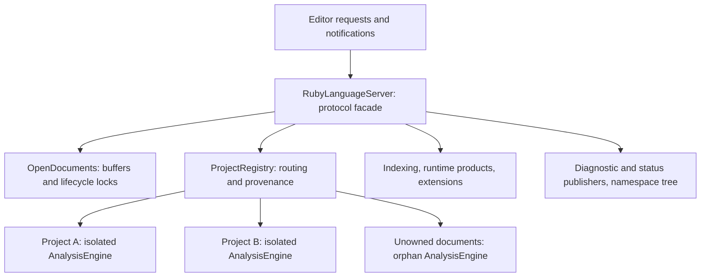

# Server state ownership

The 2026-09-10 refactor reduces `RubyLanguageServer` from **30 production fields
plus four test-only fields to 10 production fields**. `Workspace` goes from
13 fields to nine. This is an ownership and readability change; it does not
claim measured memory savings or change the semantic database representation.

Start with [server.rs](../src/server.rs): it constructs the owners and implements
the LSP protocol facade. Each module under `src/server/` keeps related state and
operations together. The semantic database remains
[AnalysisEngine](../crates/ruby-analysis/src/engine/state.rs), isolated per Ruby
project, with a separate orphan engine for unowned documents.

## The ten server fields

| Field | Responsibility | Where to read next |
| --- | --- | --- |
| `client` | Outbound LSP notifications, registration, and refresh requests. | Protocol methods in `server.rs`. |
| `config` | One shared accepted server configuration. | `config/` and initialization handlers. |
| `documents` | Open buffers, versions, document handles, and per-URI lifecycle locks. | [documents.rs](../src/server/documents.rs) |
| `projects` | Longest-root routing, isolated project engines, orphan engine, and retained external-document provenance. | [projects.rs](../src/server/projects.rs) |
| `indexing` | Project scheduler, resource governor, and sequenced status publication. | [indexing.rs](../src/server/indexing.rs) |
| `products` | Runtime discovery and shared immutable dependency products. | [products.rs](../src/server/products.rs) |
| `extensions` | Extension registry and dynamic watcher registration lifecycle. | [extensions.rs](../src/server/extensions.rs) |
| `diagnostics` | Latest-per-URI outbound queue and exact-source retained linter output. | [diagnostics.rs](../src/server/diagnostics.rs) |
| `file_changes` | Latest filesystem events and debounce generation. | [watched_files.rs](../src/server/watched_files.rs) |
| `namespace_tree` | Cached Ruby Index projection and debounced invalidation. | [namespace_tree.rs](../src/server/namespace_tree.rs) |

None of these fields is part of the public library API. `client`, `config`,
`documents`, `indexing`, `products`, and `extensions` use `pub(crate)` because
handlers and coordinators in sibling modules need them. The other four fields
are private to `server` and its child modules. The document, indexing, product,
and extension owner types are also restricted to the library.

Separate executable targets use operations such as `configuration_snapshot()`,
`configure_embedded()`, `register_indexing_run()`, and
`runtime_product_snapshot()`. Configuration and telemetry snapshots are detached
values, with no shared locks or cache handles. The two product snapshot structs
are temporary reports, not additional stored server state. Startup policy methods
require mutable access and must be called before starting work or sharing the
server. Normal LSP configuration continues through the existing handlers.

The standalone file-open profiler's low-level document instrumentation lives in
`src/perf/file_open.rs`; its executable retains the DHAT allocator and entry point.
This preserves the measurement path without exposing document-cache mutation to
other crates. The profiler's existing output schema and counter fields remain
unchanged.

## The smaller structs

Field counts below count direct production fields, including shared handles;
they are not counts of allocations or independent copies of state.

| Owner | Fields | Contents |
| --- | ---: | --- |
| `OpenDocuments` | 2 | Buffer map and weak per-document semantic locks. |
| `ProjectRegistry` | 3 | Projects, orphan engine, external-document provenance. |
| `Workspace` | 9 | Root URI/path, indexing status, engine, runtime, extension context, navigation demand, require resolution, owning editor folders. |
| `ProjectRuntimeState` | 4 | Selected runtime, Ruby version, classpath fingerprint, JRuby import provider. |
| `DependencyRequireState` | 2 | Require roots and their feature index. |
| `IndexingServices` | 3 | Scheduler, resource governor, status publisher. |
| `IndexingStatusPublisher` | 4 | Sequence, publication state, worker wakeup, runtime handle. |
| `IndexingStatusPublicationState` | 5 | Last/pending snapshots and sender/counter-flush state. |
| `RuntimeProducts` | 8 | Discovery, six product caches, binding counters. |
| `ExtensionServices` | 3 | Registry, client capability, current registration. |
| `DiagnosticPublisher` | 1 | Shared diagnostic publication state. |
| `DiagnosticPublicationState` | 3 | Pending diagnostics, sender state, retained linter output. |
| `WatchedFileChanges` / its batch | 1 / 2 | Shared batch / generation and events. |
| `NamespaceTreeCache` | 2 | Cached response and invalidation timer. |

The owners expose operations and typed handles instead of allowing callers to
replace their internal maps. `OpenDocumentView` deliberately retains the original
map lock while callers read document handles. Project runtime accessors preserve
the existing independent locks. This refactor does not introduce a global mutex
or combine state transitions that previously happened independently.

## What was removed, and what remains

- Removed the unused `reindex_timer` and stored `parent_process_id`. The parent
  monitor still captures the supplied PID and runs with its original behavior.
- Consolidated construction. `new(client)` defers extension discovery until
  initialization; embedded `Default` and `with_user_cache_root` retain eager
  environment loading. All use one common initializer.
- Removed the test-only mutable cache-root override. Cache location is now an
  ordinary construction input. The persistent cache root is immutable after
  construction; isolated fixtures pass their temporary directory before startup.
- Kept the namespace-tree invalidation timer. Its removal needs a separate
  freshness/identity audit.
- Kept open buffers separate from engine facts. Text, versions, and source
  mapping have different lifetimes from indexed cross-file semantic evidence.

Server clones share document locks, registries, publishers, schedulers, resource
admission, and cache handles. They do not copy project databases. Delayed require
refresh still holds the document, project-ownership, dependency-index, and engine
identity guards through its conditional commit and synchronous publication.

Cache policies remain unchanged: core templates are bounded at eight entries /
128 MiB estimated weight; runtime paths at 32 / 1 MiB; classpath-file metadata at
4,096 / 16 MiB; Java artifacts at 256 / 256 MiB. Gem dependency single-flight
products remain ephemeral. These independent retention ceilings are not a
measured total process memory budget.

## Tests follow production paths

There is no generic test-state bag and no test-only field on the server facade.
Three narrow fields remain under their actual owners, only in test builds:

| Field | Why it remains |
| --- | --- |
| `IndexingServices::schedule` | Pauses real collection, commit, and publication boundaries to force deterministic races. |
| `IndexingServices::progress_reports` | Records worker progress before generation filtering, so reporting and accepted client status can be checked separately. |
| `DiagnosticPublisher::submitted` | Synchronous observation for paused-race and inline assertions while production identity guards are held. It does not stand in for delivery. |

`FakeEditor` now initializes an ordinary `LspService` and consumes its real
`ClientSocket`. Its asynchronous `diagnostics()` helper waits for the latest
submitted value to arrive as a serialized `textDocument/publishDiagnostics`
notification. Missing delivery cannot satisfy an empty-clear assertion. The
harness reader acknowledges refresh/registration requests without performing
analysis or changing semantic state.

`published_diagnostics()` and inline diagnostic tags still observe synchronous
submission. Lifecycle and query helpers still invoke production handlers directly;
workspace fixture registration can also be direct. This is not an installed VS
Code test or full inbound transport test. The separate external LSP/package
harness provides complementary coverage and remains separate to avoid a crate
dependency cycle.

## Verification

Ownership regressions in [server/tests.rs](../src/server/tests.rs) cover shared
clone identity, isolated project engines, constructor behavior, cache reuse, and
actual diagnostic delivery/clearing. A harness negative control checks that an
unreceived empty notification never becomes a successful observation.

The focused server run passed 18 tests. The simulation run passed all 96 active
tests, with the three pre-existing scale/corpus deferrals unchanged. The final
`cargo test --locked --workspace --no-fail-fast` run passed **2,546 tests with zero
failures and those same three deferrals**, including five new ownership/transport
controls. The 39 fault-driver controls pass, all eight production mutation anchors
still match exactly once, and formatting/whitespace checks pass. The mutation
campaign itself was not rerun. Local logs are under
`target/server-state-refactor/`.

The visibility follow-up also passed the full workspace run: **2,546 passed,
zero failed, three unchanged deferrals, and zero compiler warnings**. Executable
targets compile against the narrowed API, and formatting/whitespace checks pass.
Its logs are under `target/server-visibility/`. The standalone profiler was
compiled but no performance run was added for this visibility change.

These checks provide regression evidence for exercised behavior, not proof that
all future scheduling or ownership bugs will be caught. No performance claim is
made by this refactor.
