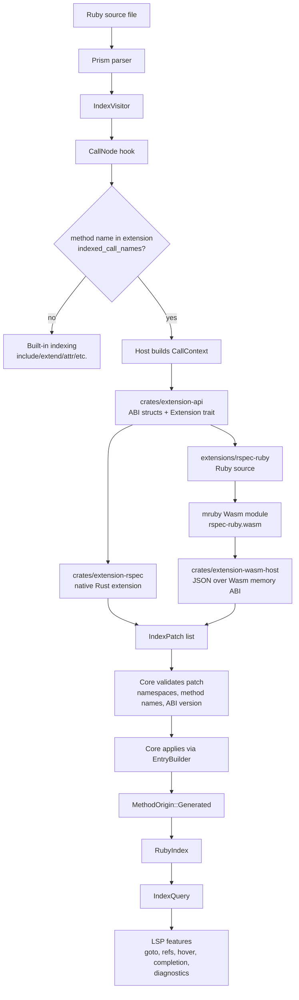
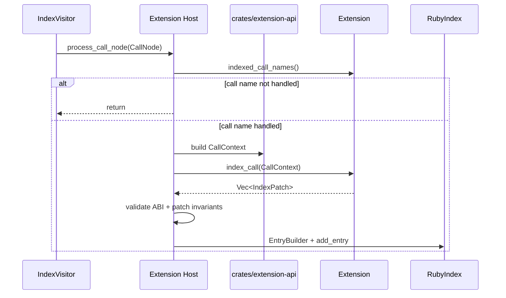
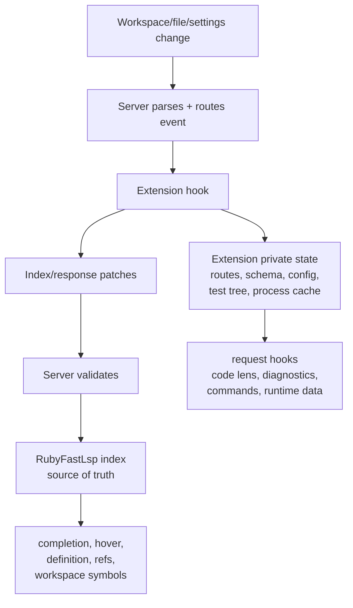

# Ruby Fast LSP Extensions

Extensions convert Ruby DSL/meta-programming calls into validated index patches.
They never mutate `RubyIndex` directly.





## Current Layout

- `crates/extension-api`: shared ABI/data model for native extensions now and Wasm/WIT later.
- `crates/extension-wasm-host`: Wasm loader using JSON over linear memory for `CallContext -> IndexPatch[]`.
- `crates/extension-rspec`: native Rust extension used as the in-process fallback/reference implementation.
- `extensions/mruby-sdk`: tiny Ruby DSL for authoring patch-based extensions.
- `extensions/rspec-ruby`: Ruby-authored RSpec extension package compiled to mruby Wasm.
- `crates/lsp-test-harness`: reusable black-box `FakeEditor` crate for extension
  tests that must drive the real LSP server from outside the core crate.

## Loading

Extensions are loaded by the LSP server, not by a separate editor plugin.
The VS Code extension should only pass config/env to the server.

Current server loaders:

```bash
RUBY_FAST_LSP_EXTENSION_PATHS=/path/to/rspec-ruby.wasm ruby-fast-lsp
RUBY_FAST_LSP_EXTENSION_PATHS=/path/to/rspec-ruby-package ruby-fast-lsp
RUBY_FAST_LSP_EXTENSION_DIRS=/path/to/extensions-dir ruby-fast-lsp
```

`RUBY_FAST_LSP_EXTENSION_PATHS` accepts platform-separated `.wasm` files or
package directories containing `extension.toml`. `RUBY_FAST_LSP_EXTENSION_DIRS`
accepts directories containing extension packages or direct `.wasm` files.

Editor clients can pass the same paths through LSP initialization options:

```json
{
  "extensionPackages": ["/path/to/rspec-ruby-package"],
  "extensionDirs": ["/path/to/extensions-dir"]
}
```

Wasm extensions handle matching calls first; built-in native extensions are
fallback.

Package shape:

- `extension.toml`
- built `.wasm`
- optional source files/docs

The server discovers `extension.toml`, validates ABI/runtime/call names, then
instantiates the `.wasm`. A VSIX/Zed extension can ship those files, but the
extension ABI stays editor-agnostic.

Minimal manifest:

```toml
id = "rspec-ruby"
name = "RSpec Ruby"
version = "0.1.0"
abi_version = 1
server_version = ">=0.2.3, <0.3.0"
runtime = "mruby-wasm"
wasm = "rspec-ruby.wasm"
checksum_sha256 = "<64 lowercase hex chars>"
capabilities = ["index.call"]
permissions = []

[indexing]
call_names = ["let", "let!", "subject", "subject!"]
```

Optional file watcher and process declarations:

```toml
permissions = ["process.exec"]

[watching]
globs = [".rubocop.yml", "config/routes.rb"]

[process]
commands = ["bundle", "ruby", "rails", "standardrb", "rubyfmt", "reek"]
```

Editor clients may pass per-extension settings during initialize:

```json
{
  "extensionPackages": ["/path/to/rspec-ruby-package"],
  "extensionDirs": ["/path/to/extensions-dir"],
  "extensionSettings": {
    "rspec-ruby": {}
  }
}
```

The server validates manifests and exposes loaded state through:

```text
ruby-fast-lsp/extensions/status
```

Validate a package before wiring it through an editor:

```bash
cargo run --bin extension validate extensions/rspec-ruby
cargo run --bin extension smoke extensions/rspec-ruby
```

## Wasm ABI V1

The first Wasm ABI is intentionally simple and mruby-friendly. The guest exports:

- `memory`
- `alloc(len: i32) -> ptr: i32`
- `dealloc(ptr: i32, len: i32)`
- `abi_version() -> i32`
- `indexed_call_names() -> packed_ptr_len: i64`
- `index_call(ptr: i32, len: i32) -> packed_ptr_len: i64`
- Optional: `handle_event(ptr: i32, len: i32) -> packed_ptr_len: i64`

`packed_ptr_len` is `((ptr as i64) << 32) | len`. Payloads are JSON encoded
`crates/extension-api` structs. This keeps the mruby bridge small; typed WIT can
replace it after the semantics settle.

`index_call` remains the compatibility hook. New extensions should prefer
`handle_event` and return an `ExtensionOutput`:

- `index_patches`: durable Ruby facts for the core index.
- `response_patches`: per-request additions such as diagnostics, code lenses,
  and document symbols.
- `command_patches`: editor-mediated actions such as terminal commands, debug
  launch requests, and notifications.

The current server routes `index.call.enter` through `handle_event` when the
guest exports it, then applies the returned `index_patches`. Response and
command patches are ABI-defined so request/command hooks can be wired without a
second guest contract change.

The mruby build uses trap-only exception handling for Wasm. Ruby exceptions
inside an extension trap the guest instead of unwinding through Wasm EH. That
matches the host contract: extensions return valid patches or fail loudly.

## Rule

Extensions describe facts. Core validates and owns index state.

## Extension State Model

Extensions can maintain private state, but only the LSP server owns Ruby facts.



Rules:

- Core index stores normalized Ruby facts: classes, modules, methods, constants,
  references, generated DSL declarations, signatures, includes, and extends.
- Extension state stores private runtime/config/cache data only.
- Extensions never mutate `RubyIndex` directly.
- Extensions emit patches; server validates and applies patches.
- Request hooks may use extension state to add responses, but durable facts still
  flow through the core index.

Example: Rails extension state may cache routes, schema, view paths, and runner
snapshots. The core index still owns generated association methods like
`User#company` and `User#company=`.

## Roadmap to 9/10 Extension Infra

Current rating: 8.7/10.

What is done:

- Server-scoped extension registry.
- Manifest/package loading with ABI, runtime, server version, and checksum
  validation.
- mruby-authored RSpec extension compiled to Wasm and packaged in VSIX.
- Native Rust RSpec extension kept as fallback/reference implementation.
- Extension-generated methods, mixins, document symbols, and code lenses.
- Recoverable failure path for bad response patches and guest failures.
- Full test suite green for current scope.

What remains to reach 9.5+/10:

- Route extension hooks through the same full method resolver used by core
  definition/diagnostic logic, including deterministic handling of ambiguous
  callees.
- Expand ABI beyond current patch set: hover, completion, diagnostics, code
  actions, test items, formatting, definition locations, and references.
- Add hard runtime budgets for every extension: fuel, memory, payload size,
  timeout, and slow-extension status.
- Publish stable Ruby SDK docs with versioning/migration rules for third-party
  extension authors.
- Add perf benchmarks for many loaded extensions and large projects.
- Finish editor-neutral install/update flow for VS Code and Zed wrappers.
- Cover the major Ruby extension shapes: Rails indexing subset, Standard,
  rubyfmt, Reek, and deeper RSpec test discovery/run/debug.

### Package V2

- Require `extension.toml` for editor-installed packages.
- Keep direct `.wasm` loading as development-only env support.
- Add manifest fields: `id`, `name`, `version`, `abi_version`,
  `server_version`, `runtime`, `wasm`, `capabilities`, `permissions`, and
  `settings_schema`.
- Validate manifest, wasm path, runtime, ABI, capability metadata, and checksum
  before activation.
- Bad package loads must disable that extension and report a warning, not crash
  the language server.

### Registry

- Replace ad-hoc global wasm list with `ExtensionRegistry`.
- Track each extension state: `loaded`, `disabled`, `failed`, `slow`.
- Enforce per-extension fuel, memory, payload, and timeout limits.
- Avoid holding global registry locks while running guest code.
- Expose extension status through a custom LSP request for editor UI/logs.

Current registry slice:

- `ExtensionRegistry` owns loaded Wasm extension slots.
- Global registry lock is used only to swap configuration or clone extension
  handles.
- Each Wasm extension has its own lock and status.
- Runtime extension failure disables only that extension.
- Editor/status tooling can call `ruby-fast-lsp/extensions/status`.

### ABI V2

Host calls extensions through capability events instead of hardcoded exports.

Current slice:

- `handle_event(event_json)` is implemented as an optional Wasm export.
- `index.call.enter` is routed through `handle_event` first, with fallback to
  `index_call`.
- mruby SDK exposes `handle_event(raw_event)` and returns `ExtensionOutput`.
- RSpec Ruby exports both `handle_event` and the compatibility `index_call`.

Required exports:

- `extension_info()`
- `activate(ctx)`
- `deactivate()`
- `handle_event(event_json)`
- `settings_changed(json)`
- `watched_files_changed(json)`

Events:

- `index.call.enter`
- `index.call.leave`
- `index.class.enter`
- `index.module.enter`
- `request.hover`
- `request.definition`
- `request.completion`
- `request.code_lens`
- `request.document_symbol`
- `request.format`
- `request.diagnostics`
- `request.code_action`
- `test.discover`
- `command.execute`

### Patch Model

Index patches:

- define method
- define namespace
- define constant
- define attr reader/writer/accessor
- include/extend/prepend module
- define signature/parameters
- define type metadata
- define reference edge

Response patches:

- hover item
- definition location
- completion item
- code lens
- document symbol
- diagnostic
- text edit
- code action
- test item

Command patches:

- run terminal command
- launch debug config
- apply workspace edit
- show notification/progress

Every patch carries `extension_id`, source macro/event, priority, and conflict
mode. Server owns merge/conflict policy.

### Settings and Watchers

- Add `rubyFastLsp.extensionSettings`.
- Route per-extension settings to `activate` and `settings_changed`.
- Let manifests declare watched file globs.
- Register file watchers through LSP when the client supports them.
- Route changes for files such as `.rubocop.yml`, `.standard.yml`,
  `config/routes.rb`, and `db/schema.rb`.

### External Process Host

Some major Ruby integrations need external processes: Rails, Standard, rubyfmt,
Reek, and RuboCop-style tools.

- Manifest permissions must declare `process.exec`.
- Commands must be allowlisted by manifest.
- Host runs processes; wasm receives capped stdout/stderr/status.
- No arbitrary shell by default.
- Apply timeout, output, and working-directory limits.

### Discovery and Installation

- Editor wrappers ship/advertise extension package directories only.
- Server remains source of truth for loading and validation.
- Discover packages from:
  - editor-provided `extensionPackages`
  - editor-provided `extensionDirs`
  - `.ruby-fast-lsp/extensions/*/extension.toml`
  - workspace `ruby_fast_lsp/**/extension.toml`
  - optional Bundler/gem scan later

### Core Extension Targets

- `rspec-ruby`: indexing, document symbols, code lens, test discovery, run/debug.
- `standard-ruby`: diagnostics, formatting, code actions.
- `rubyfmt`: formatting.
- `reek`: diagnostics.
- `rails-ruby`: associations/callbacks/validations, document symbols,
  route/view definitions, controlled runtime introspection.

### Acceptance Gate

Extension infra reaches 9/10 only when:

- Bad extension cannot crash the server.
- Slow extension cannot freeze indexing or requests.
- VS Code and Zed install through the same package protocol.
- Manifest compatibility gates are enforced.
- Settings, watchers, external process permissions, and status reporting work.
- At least five extension shapes are covered: RSpec, Rails indexing subset,
  Standard, rubyfmt, and Reek.
- Tests cover manifest errors, ABI mismatch, wasm trap, timeout, settings,
  file watchers, process exec, and each capability family.
