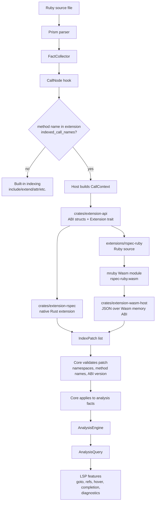
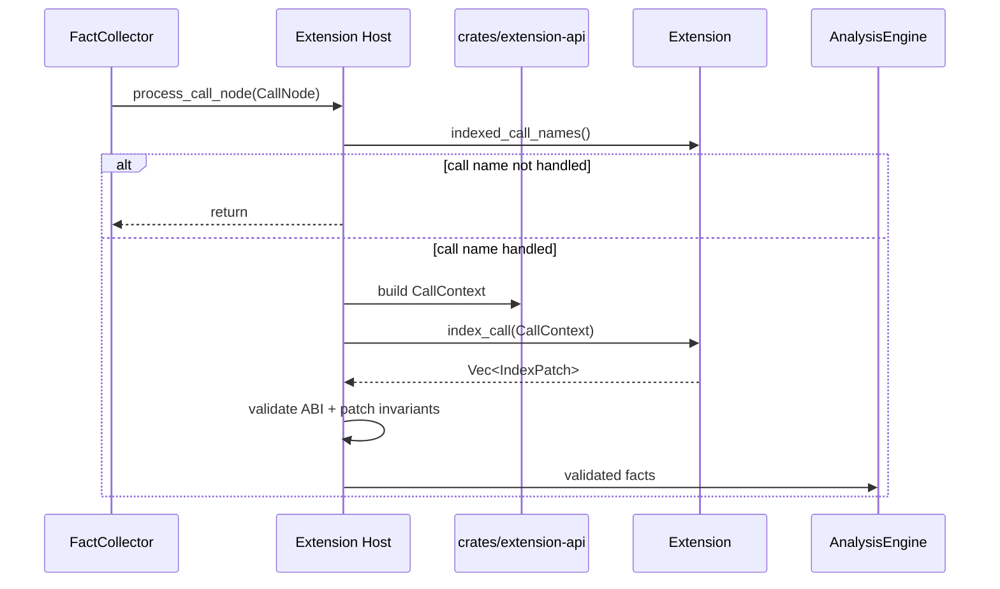
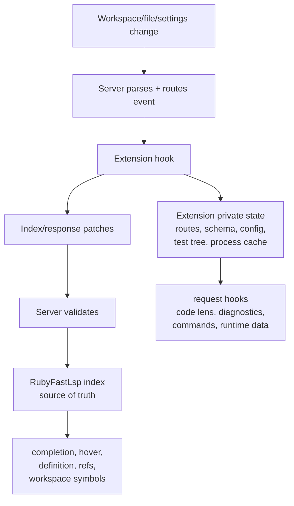

# Ruby Fast LSP Extensions

Extensions convert Ruby DSL/meta-programming calls into validated analysis patches.
They never mutate the analysis engine directly.


```mermaid
flowchart TD
    RubySource[Ruby source file] --> Prism[Prism parser]
    Prism --> FactCollector[FactCollector]
    FactCollector --> CallNode[CallNode hook]

    CallNode --> Filter{method name in extension\nindexed_call_names?}
    Filter -- no --> Builtins[Built-in indexing\ninclude/extend/attr/etc.]
    Filter -- yes --> HostCtx[Host builds CallContext]

    HostCtx --> ExtApi[crates/extension-api\nABI structs + Extension trait]
    ExtApi --> RSpecRust[crates/extension-rspec\nnative Rust extension]
    ExtApi --> RSpecRuby[extensions/rspec-ruby\nRuby source]
    RSpecRuby --> Mruby[mruby Wasm module\nrspec-ruby.wasm]
    Mruby --> WasmHost[crates/extension-wasm-host\nJSON over Wasm memory ABI]
    RSpecRust --> Patches[IndexPatch list]
    WasmHost --> Patches

    Patches --> Validate[Core validates patch\nnamespaces, method names, ABI version]
    Validate --> Apply[Core applies to analysis facts]
    Apply --> Engine[AnalysisEngine]

    Engine --> Query[AnalysisQuery]
    Query --> LspFeatures[LSP features\ngoto, refs, hover, completion,\ndiagnostics]
```


```mermaid
sequenceDiagram
    participant V as FactCollector
    participant H as Extension Host
    participant A as crates/extension-api
    participant R as Extension
    participant I as AnalysisEngine

    V->>H: process_call_node(CallNode)
    H->>R: indexed_call_names()
    alt call name not handled
        H-->>V: return
    else call name handled
        H->>A: build CallContext
        H->>R: index_call(CallContext)
        R-->>H: Vec<IndexPatch>
        H->>H: validate ABI + patch invariants
        H->>I: validated facts
    end
```

## Current Layout

- `crates/extension-api`: shared ABI/data model for native extensions now and Wasm/WIT later.
- `crates/extension-wasm-host`: Wasm loader using JSON over linear memory for `CallContext -> IndexPatch[]`.
- `crates/extension-rspec`: native Rust extension used as the in-process fallback/reference implementation.
- `extensions/mruby-sdk`: tiny Ruby DSL for authoring patch-based extensions.
- `extensions/rspec-ruby`: Ruby-authored RSpec extension package compiled to mruby Wasm.
- `extensions/example-dsl`: independent, copyable third-party package and
  public-contract acceptance fixture.
- `crates/lsp-test-harness`: reusable black-box `FakeEditor` crate for extension
  tests that must drive the real LSP server from outside the core crate.

## Loading

Extensions are loaded by the LSP server, not by a separate editor plugin.
The VS Code extension should only pass config/env to the server.

Current server loaders:

```bash
RUBY_FAST_LSP_EXTENSION_PATHS=/path/to/rspec-ruby.wasm ruby-fast-lsp
RUBY_FAST_LSP_EXTENSION_PATHS=/path/to/rspec-ruby-package ruby-fast-lsp
RUBY_FAST_LSP_EXTENSION_DIRS=/path/to/extensions-dir ruby-fast-lsp
```

`RUBY_FAST_LSP_EXTENSION_PATHS` accepts platform-separated `.wasm` files or
package directories containing `extension.toml`. `RUBY_FAST_LSP_EXTENSION_DIRS`
accepts directories containing extension packages or direct `.wasm` files.

Editor clients can pass the same paths through LSP initialization options:

```json
{
  "extensionPackages": ["/path/to/rspec-ruby-package"],
  "extensionDirs": ["/path/to/extensions-dir"]
}
```

Trusted workspaces also discover manifest packages from:

- `.ruby-fast-lsp/extensions/*/extension.toml`
- `ruby_fast_lsp/**/extension.toml`

Project-local discovery requires both `workspaceTrusted: true` from the client
and `projectExtensionsEnabled: true` (the default). VS Code maps this to its
workspace trust/Restricted Mode state and restarts the server when trust is
granted. Other clients must opt in explicitly; omitting trust is fail-closed.

Precedence is deterministic: editor/configured packages and directories win,
then project-local packages, then environment/development paths. Explicit
packages win over directory discovery within a source, and filesystem path is
the final tie-break. A lower-priority valid package may load only when every
higher-priority package with the same ID fails validation.

Wasm extensions handle matching calls first; built-in native extensions are
fallback.

Package shape:

- `extension.toml`
- built `.wasm`
- optional source files/docs

The server discovers `extension.toml`, validates ABI/runtime/call names, then
instantiates the `.wasm`. A VSIX/Zed extension can ship those files, but the
extension ABI stays editor-agnostic.

Minimal manifest:

```toml
id = "rspec-ruby"
name = "RSpec Ruby"
version = "0.1.0"
abi_version = 1
server_version = ">=0.2.3, <0.3.0"
runtime = "mruby-wasm"
wasm = "rspec-ruby.wasm"
checksum_sha256 = "<64 lowercase hex chars>"
capabilities = ["index.call"]
permissions = []

[indexing]
call_names = ["let", "let!", "subject", "subject!"]
```

Optional file watcher and process declarations:

```toml
capabilities = ["watching", "process"]
permissions = ["process.exec"]

[watching]
globs = [".rubocop.yml", "config/routes.rb"]

[process]
commands = ["bundle", "ruby", "rails", "standardrb", "rubyfmt", "reek"]
```

Watcher globs are workspace-relative. Absolute paths, parent traversal, invalid
glob syntax, and `[watching]` without the `watching` capability reject the
package. When the client supports dynamic registration, the server registers
the sorted union through `workspace/didChangeWatchedFiles` and refreshes it
after extension or workspace changes. Clients without dynamic registration may
send the same standard notification through their own watcher setup.

Each loaded extension receives only its matching, in-workspace changes through
`files.changed`. Changes contain `workspace_root`, normalized relative `path`,
`uri`, and `kind` (`Created`, `Changed`, or `Deleted`); nested workspaces use the
deepest root, and duplicate events are removed deterministically. The mruby SDK
exposes `on_watched_files_changed`. The callback may update private extension
state or return bounded `process_request` values. Other watcher patches are
rejected until they have a dedicated engine-owned ingestion contract.

Editor clients may pass per-extension settings during initialize:

```json
{
  "extensionPackages": ["/path/to/rspec-ruby-package"],
  "extensionDirs": ["/path/to/extensions-dir"],
  "extensionSettings": {
    "rspec-ruby": {}
  }
}
```

The host sends `lifecycle.activate` after a guest is instantiated and before it
can receive indexing or request events. The event includes that extension's
entry from `extensionSettings`. Settings-only configuration changes preserve the
guest and send `settings.changed`; a failed guest is recreated on the next
configuration change so corrected settings can recover it. Package/discovery
changes activate the replacement registry before swapping it in, then
deactivate the old registry. LSP shutdown sends `lifecycle.deactivate` and waits
for every loaded guest to finish within the normal Wasm execution limits.

The mruby SDK exposes `on_activate`, `on_settings_changed`, `on_deactivate`, and
the current `settings` value. Lifecycle callbacks maintain private extension
state only; returning semantic, response, or command patches from lifecycle
events disables the extension.

The server validates manifests and exposes loaded state through:

```text
ruby-fast-lsp/extensions/status
```

Validate a package before wiring it through an editor:

```bash
cargo run --bin extension validate extensions/rspec-ruby
cargo run --bin extension smoke extensions/rspec-ruby
```

## Wasm ABI V1

The first Wasm ABI is intentionally simple and mruby-friendly. The guest exports:

- `memory`
- `alloc(len: i32) -> ptr: i32`
- `dealloc(ptr: i32, len: i32)`
- `abi_version() -> i32`
- `indexed_call_names() -> packed_ptr_len: i64`
- `index_call(ptr: i32, len: i32) -> packed_ptr_len: i64`
- Optional: `handle_event(ptr: i32, len: i32) -> packed_ptr_len: i64`

`packed_ptr_len` is `((ptr as i64) << 32) | len`. Payloads are JSON encoded
`crates/extension-api` structs. This keeps the mruby bridge small; typed WIT can
replace it after the semantics settle.

`index_call` remains the compatibility hook. New extensions should prefer
`handle_event` and return an `ExtensionOutput`:

- `index_patches`: durable Ruby facts for the core index.
- `response_patches`: per-request additions such as diagnostics, code lenses,
  and document symbols.
- `command_patches`: editor-mediated actions such as terminal commands, debug
  launch requests, and notifications.

The current server routes `index.call.enter` through `handle_event` when the
guest exports it, then applies the returned `index_patches`. Response and
command patches are ABI-defined so request/command hooks can be wired without a
second guest contract change.

`CallContext.resolved_callees` is produced by the core analysis query path
resolver. A callee can be:

- `Exact`: method definition was found through Ruby method lookup / ancestor
  chain.
- `ReceiverOnly`: receiver namespace resolved, but the method is not in the
  index yet. This is the deterministic meta-programming escape hatch for DSLs
  such as `RSpec.describe`.

Ambiguity is represented as multiple callees. Extensions must inspect the owner,
owner kind, method, and resolution before emitting patches.

The mruby build uses trap-only exception handling for Wasm. Ruby exceptions
inside an extension trap the guest instead of unwinding through Wasm EH. That
matches the host contract: extensions return valid patches or fail loudly.

## Rule

Extensions describe facts. Core validates and owns index state.

## Extension State Model

Extensions can maintain private state, but only the LSP server owns Ruby facts.


```mermaid
flowchart TD
    Change[Workspace/file/settings change] --> Server[Server parses + routes event]
    Server --> Hook[Extension hook]
    Hook --> PrivateState[Extension private state\nroutes, schema, config,\ntest tree, process cache]
    Hook --> Patch[Index/response patches]
    Patch --> Validate[Server validates]
    Validate --> CoreIndex[RubyFastLsp index\nsource of truth]
    CoreIndex --> Features[completion, hover,\ndefinition, refs,\nworkspace symbols]
    PrivateState --> RequestHooks[request hooks\ncode lens, diagnostics,\ncommands, runtime data]
```

Rules:

- Core index stores normalized Ruby facts: classes, modules, methods, constants,
  references, generated DSL declarations, signatures, superclass relationships,
  includes, and extends.
- Extension state stores private runtime/config/cache data only.
- Extensions never mutate the analysis engine directly.
- Extensions emit patches; server validates and applies patches.
- Request hooks may use extension state to add responses, but durable facts still
  flow through the core index.

Example: Rails extension state may cache routes, schema, view paths, and runner
snapshots. The core index still owns generated association methods like
`User#company` and `User#company=`.

Generated inheritance uses `SetSuperclass` together with a matching
`DefineNamespace` class patch from the same guest callback. This restriction
prevents extensions from replacing parser-owned superclass declarations. The
host validates and merges the relationship deterministically, then converts it
to ordinary `Superclass` graph facts; engine MRO and hierarchy queries remain
the only semantic authority.

## Roadmap to 9/10 Extension Infra

Current rating: 8.7/10.

What is done:

- Server-scoped extension registry.
- Manifest/package loading with ABI, runtime, server version, and checksum
  validation.
- mruby-authored RSpec extension compiled to Wasm and packaged in VSIX.
- Native Rust RSpec extension kept as fallback/reference implementation.
- Extension-generated methods, mixins, document symbols, and code lenses.
- Extension hook context uses the same core method-resolution path as
  definitions, including exact and receiver-only callee options.
- Wasm host enforces input/output payload limits, memory growth limits, and
  per-call fuel budgets. A 500 ms Wasmtime epoch deadline independently bounds
  wall-clock execution at every guest call boundary. Failures are recoverable
  and disable only that extension; deadline failures are observable as `slow`.
- Recoverable failure path for bad response patches and guest failures.
- Full test suite green for current scope.

What remains to reach 9.5+/10:

- Push the shared resolver into remaining diagnostics/reference paths that still
  carry local lookup variants.
- Expand ABI beyond current patch set: hover, completion, diagnostics, code
  actions, test items, formatting, definition locations, and references.
- Add configurable per-capability timeout budgets and performance reporting on
  top of the enforced 500 ms wall-clock ceiling.
- Publish stable Ruby SDK docs with versioning/migration rules for third-party
  extension authors.
- Add perf benchmarks for many loaded extensions and large projects.
- Finish editor-neutral install/update flow for VS Code and Zed wrappers.
- Cover the major Ruby extension shapes: Rails indexing subset, Standard,
  rubyfmt, Reek, and deeper RSpec test discovery/run/debug.

### Package V2

- Require `extension.toml` for editor-installed packages.
- Keep direct `.wasm` loading as development-only env support.
- Add manifest fields: `id`, `name`, `version`, `abi_version`,
  `server_version`, `runtime`, `wasm`, `capabilities`, `permissions`, and
  `settings_schema`.
- Validate manifest, wasm path, runtime, ABI, capability metadata, and checksum
  before activation.
- Bad package loads must disable that extension and report a warning, not crash
  the language server.

### Registry

- Replace ad-hoc global wasm list with `ExtensionRegistry`.
- Track each extension state: `loaded`, `disabled`, `failed`, `slow`.
- Enforce per-extension fuel, memory, payload, and timeout limits.
- Avoid holding global registry locks while running guest code.
- Expose extension status through a custom LSP request for editor UI/logs.

Current registry slice:

- `ExtensionRegistry` owns loaded Wasm extension slots.
- Discovery precedence is deterministic: initialization-option sources override
  environment sources, explicit package paths override directory discovery
  within the same source, and filesystem path breaks remaining ties.
- Extension identity is unique. After the highest-priority valid package for an
  `id` loads, lower-priority duplicates are rejected before they can dispatch
  events or contribute semantic patches.
- Global registry lock is used only to swap configuration or clone extension
  handles.
- Each Wasm extension has its own lock and status.
- Runtime extension failure disables only that extension.
- Editor/status tooling can call `ruby-fast-lsp/extensions/status`.

### ABI V2

Host calls extensions through capability events instead of hardcoded exports.

Current slice:

- `handle_event(event_json)` is implemented as an optional Wasm export.
- `index.call.enter` is routed through `handle_event` first, with fallback to
  `index_call`.
- mruby SDK exposes `handle_event(raw_event)` and returns `ExtensionOutput`.
- RSpec Ruby exports both `handle_event` and the compatibility `index_call`.

Lifecycle is currently carried through `handle_event`; future dedicated exports
may optimize this without changing the event contract:

- `extension_info()`
- `handle_event(event_json)`
- `watched_files_changed(json)`

Events:

- `files.changed`
- `index.call.enter`
- `index.call.leave`
- `index.class.enter`
- `index.module.enter`
- `request.hover`
- `request.definition`
- `request.completion`
- `request.code_lens`
- `request.document_symbol`
- `request.format`
- `request.diagnostics`
- `request.code_action`
- `test.discover`
- `command.execute`

### Patch Model

Index patches:

- define method
- define namespace
- define constant
- define attr reader/writer/accessor
- include/extend/prepend module
- define signature/parameters
- define type metadata
- define reference edge

The implemented `define method` contract preserves parameter kinds, public /
protected / private visibility, and optional named return types. Declared return
types participate in same-file inference immediately and are stored as
extension-provenance method-return facts; removing the source DSL call removes
both method and type facts on normal reindex.

Response patches:

- hover item
- definition location
- completion item
- code lens
- document symbol
- diagnostic
- text edit
- code action
- test item

Command patches:

- run terminal command
- launch debug config
- apply workspace edit
- show notification/progress

Every patch carries `extension_id` and its source macro/event. The server
validates that provenance against the loaded manifest before ingestion. For the
current semantic patch families, equivalent facts for one semantic identity are
deduplicated deterministically by extension ID; incompatible facts are rejected
and every conflicting guest is disabled. This fail-closed policy prevents
extension ordering or timing from creating ambiguous engine state. Explicit
priority/override modes may be added only with a versioned contract and tests
for every patch family.

### Settings and Watchers

- Done: `rubyFastLsp.extensionSettings` is routed through bounded
  `lifecycle.activate` and `settings.changed` events.
- Done: package reload and server shutdown send bounded
  `lifecycle.deactivate` events, and lifecycle failures disable only that guest.
- Done: manifests declare validated workspace-relative watched-file globs; the
  server dynamically registers their deterministic union when supported.
- Done: matching changes such as `.rubocop.yml`, `.standard.yml`,
  `config/routes.rb`, and `db/schema.rb` route through bounded `files.changed`
  events and isolate failing guests.

### External Process Host

Some major Ruby integrations need external processes: Rails, Standard, rubyfmt,
Reek, and RuboCop-style tools.

- Done: manifests must declare the `process` capability, `process.exec`
  permission, and an exact command allowlist.
- Done: process requests are accepted only for trusted workspaces and the
  workspace roots related to the triggering event.
- Done: the host launches commands directly without an implicit shell, caps
  argument/stdin sizes and request count, applies a 10-second maximum timeout,
  drains output while retaining at most 256 KiB per stream, and kills timed-out
  children.
- Done: wasm guests receive `process.completed` with exit status, bounded
  stdout/stderr, and truncation flags; spawn failures and nonzero exits remain
  isolated results while policy violations disable the requesting guest.
- Done: completion callbacks may request bounded reindexing of files under the
  event-related workspace roots. Paths are validated against absolute/traversal
  escape, deduplicated, and fed through normal file processing so runtime state
  cannot bypass semantic patch validation or engine replacement.

### Discovery and Installation

- Editor wrappers ship/advertise extension package directories only.
- Server remains source of truth for loading and validation.
- Discover packages from:
  - editor-provided `extensionPackages`
  - editor-provided `extensionDirs`
  - `.ruby-fast-lsp/extensions/*/extension.toml`
  - workspace `ruby_fast_lsp/**/extension.toml`
  - optional Bundler/gem scan later
- Done: project-local discovery is trust-gated, multi-root deterministic, and
  lower priority than editor/bundled packages but higher than environment paths.

### Core Extension Targets

- `rspec-ruby`: indexing, document symbols, code lens, test discovery, run/debug.
- `standard-ruby`: diagnostics, formatting, code actions.
- `rubyfmt`: formatting.
- `reek`: diagnostics.
- `rails-ruby`: associations/callbacks/validations, document symbols,
  route/view definitions, controlled runtime introspection.

### Acceptance Gate

Extension infra reaches 9/10 only when:

- Bad extension cannot crash the server.
- Slow extension cannot freeze indexing or requests.
- VS Code and Zed install through the same package protocol.
- Manifest compatibility gates are enforced.
- Settings, watchers, external process permissions, and status reporting work.
- At least five extension shapes are covered: RSpec, Rails indexing subset,
  Standard, rubyfmt, and Reek.
- Tests cover manifest errors, ABI mismatch, wasm trap, timeout, settings,
  file watchers, process exec, and each capability family.
