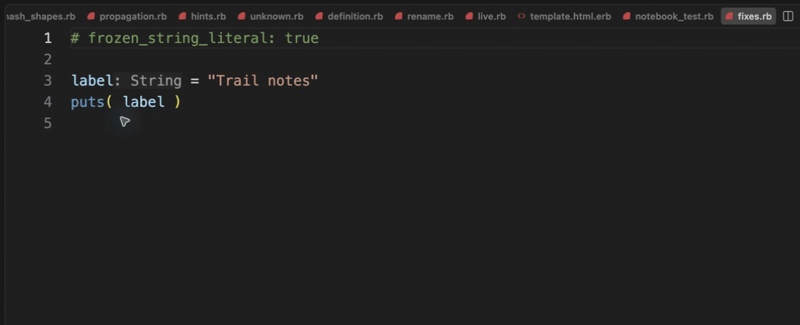

# Safe formatting

[Video](demo.mp4) · [Source example](../../../../demos/fixtures/diagnostics/fixes.rb) · [Capture metadata](metadata.json)

1. Select RuboCop with Ruby Fast LSP: Select Formatter before recording.
2. Run Format Document on puts( label ).
3. Inspect the safe whitespace correction to puts(label).

Recorded with the current source in a temporary extension development host.

Read pauses are edited; typing frames use 60–100 ms ordinary gaps where typing is shown.

Keyboard commands and mouse interactions use the real editor. Pointer motion between sampled frames is not continuous.
