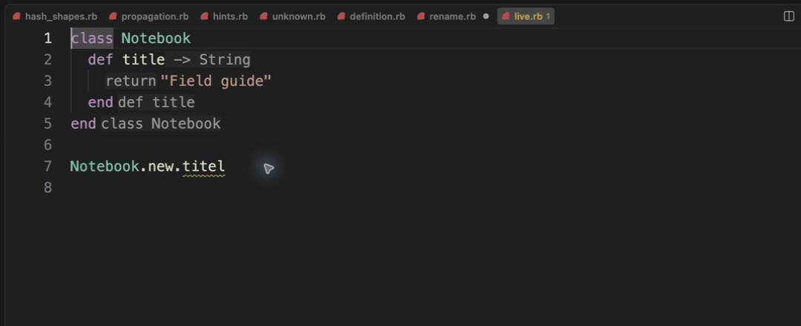

# Live diagnostics

[Video](demo.mp4) · [Source example](../../../../demos/fixtures/diagnostics/live.rb) · [Capture metadata](metadata.json)

1. Read the missing-method underline.
2. Show Hover to read the suggested spelling.
3. Replace titel with title and watch the diagnostic clear.

Recorded with the current source in a temporary extension development host.

Read pauses are edited; typing frames use 60–100 ms ordinary gaps where typing is shown.

Keyboard commands and mouse interactions use the real editor. Pointer motion between sampled frames is not continuous.
