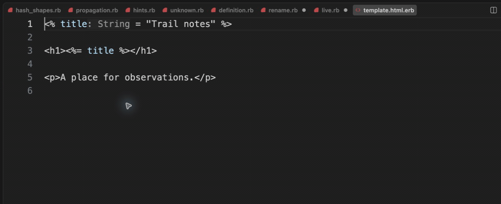

# Ruby navigation inside ERB

[Video](demo.mp4) · [Source example](../../../../demos/fixtures/frameworks/template.html.erb) · [Capture metadata](metadata.json)

1. Inspect the Ruby declaration and its type hint inside ERB.
2. Place the cursor on the binding use in the h1 tag and press F12.
3. Navigation reaches the original declaration inside the first tag.

Recorded with the current source in a temporary extension development host.

Read pauses are edited; typing frames use 60–100 ms ordinary gaps where typing is shown.

Keyboard commands and mouse interactions use the real editor. Pointer motion between sampled frames is not continuous.

This clip demonstrates navigation. Cross-tag binding hover currently reports an unknown type even when the declaration has a String hint.
