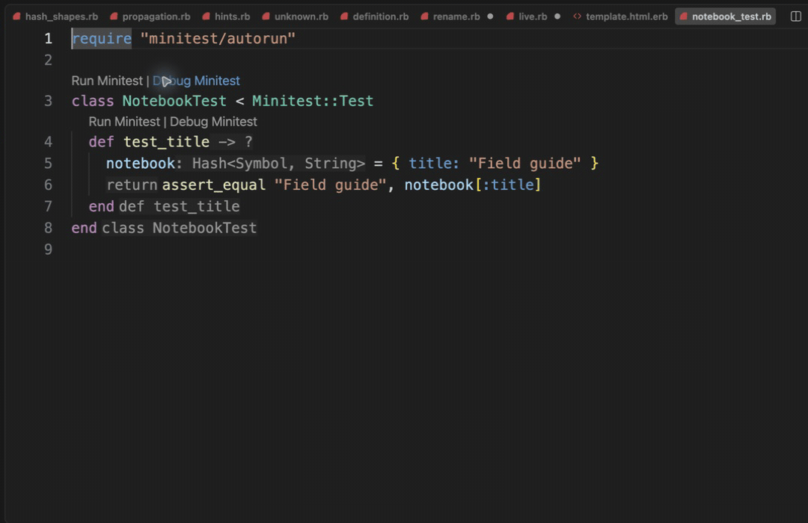

# Run a focused Minitest

[Video](demo.mp4) · [Source example](../../../../demos/fixtures/frameworks/notebook_test.rb) · [Capture metadata](metadata.json)

1. Use the bundled Minitest extension with the supplied complete Gemfile.lock.
2. Click Run Minitest above test_title.
3. Inspect the real terminal result: one test, one assertion, zero failures.

Recorded with the current source in a temporary extension development host.

Read pauses are edited; typing frames use 60–100 ms ordinary gaps where typing is shown.

Keyboard commands and mouse interactions use the real editor. Pointer motion between sampled frames is not continuous.

The process passes. Minitest 5.20.0 also emits a Ruby warning about the future packaging of mutex_m; this is visible in the terminal.
