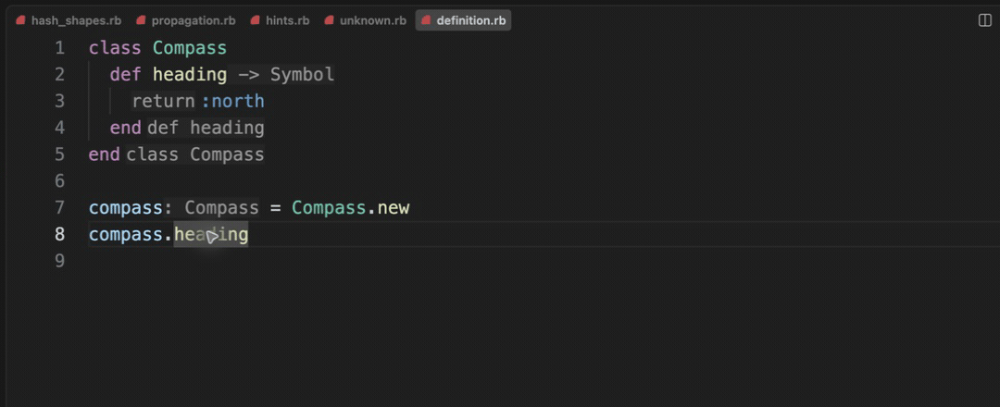

# Go to definition

[Video](demo.mp4) · [Source example](../../../../demos/fixtures/navigate/definition.rb) · [Capture metadata](metadata.json)

1. Place the cursor on compass.heading.
2. Press F12 to reach Compass#heading.

Recorded with the current source in a temporary extension development host.

Read pauses are edited; typing frames use 60–100 ms ordinary gaps where typing is shown.

Keyboard commands and mouse interactions use the real editor. Pointer motion between sampled frames is not continuous.
