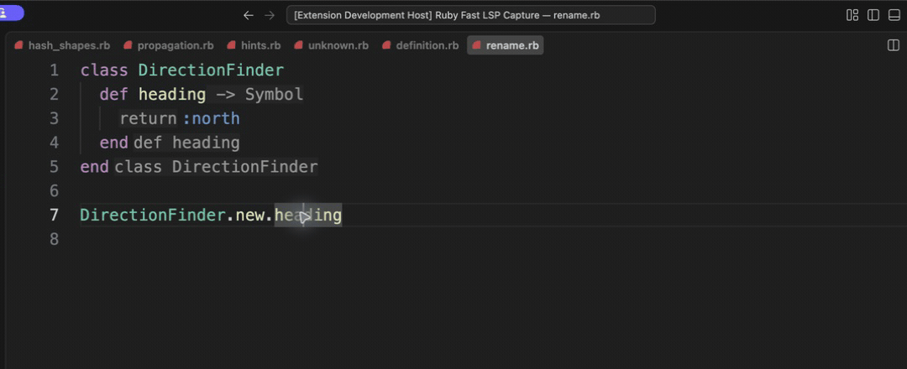

# Semantic rename

[Video](demo.mp4) · [Source example](../../../../demos/fixtures/navigate/rename.rb) · [Capture metadata](metadata.json)

1. Place the cursor on the heading call and press F2.
2. Type bearing in the rename input.
3. Accept the rename; both the declaration and use change.

Recorded with the current source in a temporary extension development host.

Read pauses are edited; typing frames use 60–100 ms ordinary gaps where typing is shown.

Keyboard commands and mouse interactions use the real editor. Pointer motion between sampled frames is not continuous.
