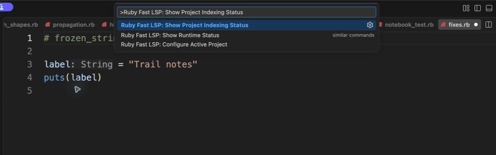

# Project indexing status

[Video](demo.mp4) · [Source example](../../../../demos/fixtures/projects/letters/identity.rb) · [Capture metadata](metadata.json)

1. Open Show Project Indexing Status from the command palette.
2. Inspect the ready projects, active jobs, and cache summary.

Recorded with the current source in a temporary extension development host.

Read pauses are edited; typing frames use 60–100 ms ordinary gaps where typing is shown.

Keyboard commands and mouse interactions use the real editor. Pointer motion between sampled frames is not continuous.

Shows the ready-state inspection UI, not a cold-indexing timeline or benchmark.
