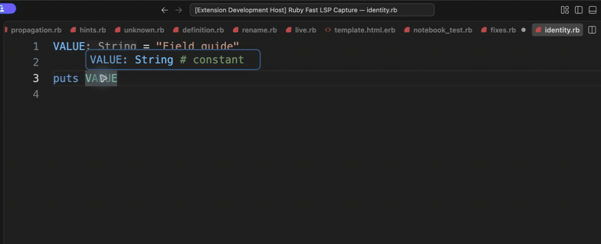

# Independent project types

[Video](demo.mp4) · [Source example](../../../../demos/fixtures/projects/letters/identity.rb) · [Capture metadata](metadata.json)

1. Show Hover on VALUE in the letters project: String.
2. Open numbers/identity.rb from the other project.
3. Show Hover on VALUE: Integer.

Recorded with the current source in a temporary extension development host.

Read pauses are edited; typing frames use 60–100 ms ordinary gaps where typing is shown.

Keyboard commands and mouse interactions use the real editor. Pointer motion between sampled frames is not continuous.
