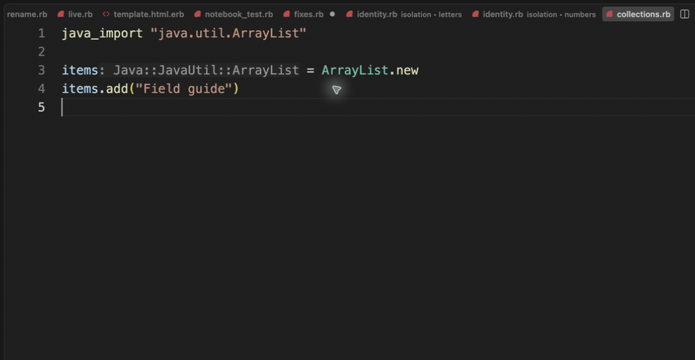

# Navigate from JRuby into Java

[Video](demo.mp4) · [Source example](../../../../demos/fixtures/projects/java/collections.rb) · [Capture metadata](metadata.json)

1. Open the example in a project using JRuby 9.2.21.0 and an installed JDK.
2. Press F12 on ArrayList to reach the import binding.
3. Press F12 on the imported class name to open the available OpenJDK source.

Recorded with the current source in a temporary extension development host.

Read pauses are edited; typing frames use 60–100 ms ordinary gaps where typing is shown.

Keyboard commands and mouse interactions use the real editor. Pointer motion between sampled frames is not continuous.

The navigation destination is OpenJDK ArrayList.java, copyright Oracle and contributors, GPL-2.0 with the Classpath exception. The demo Ruby source is synthetic. java_import works in this JRuby runtime without an explicit require "java"; the example was executed separately.
