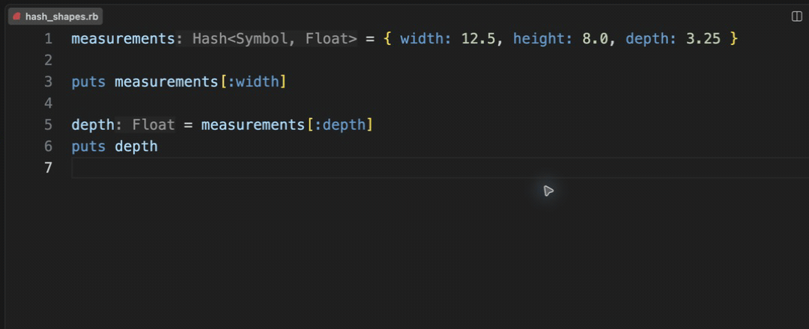

# Hash shapes

[Video](demo.mp4) · [Source example](../../../../demos/fixtures/types/hash_shapes.rb) · [Capture metadata](metadata.json)

1. Read the compact Hash<Symbol, Float> hint.
2. Hover the hint prefix to expand the shape.
3. Use Show Hover on depth to inspect the Float returned by the key lookup.

Recorded with the current source in a temporary extension development host.

Read pauses are edited; typing frames use 60–100 ms ordinary gaps where typing is shown.

Keyboard commands and mouse interactions use the real editor. Pointer motion between sampled frames is not continuous.
