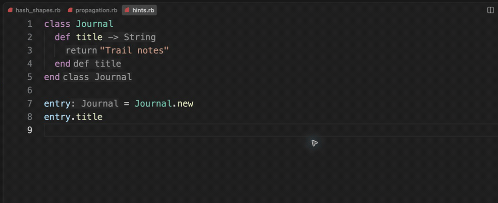

# Compact type hints

[Video](demo.mp4) · [Source example](../../../../demos/fixtures/types/hints.rb) · [Capture metadata](metadata.json)

1. Read the local and method return hints.
2. Hover the Journal type label to inspect its type and navigation affordance.
3. Show Hover on the title call to inspect String.

Recorded with the current source in a temporary extension development host.

Read pauses are edited; typing frames use 60–100 ms ordinary gaps where typing is shown.

Keyboard commands and mouse interactions use the real editor. Pointer motion between sampled frames is not continuous.
