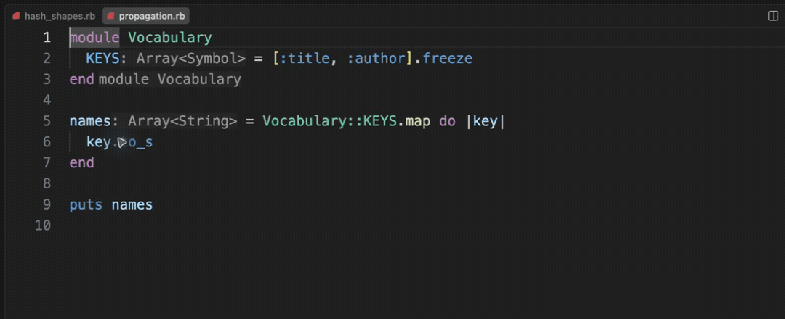

# Collection type propagation

[Video](demo.mp4) · [Source example](../../../../demos/fixtures/types/propagation.rb) · [Capture metadata](metadata.json)

1. Inspect the Array<Symbol> constant and Array<String> result.
2. Show Hover on the block parameter: Symbol.
3. Show Hover on names: Array<String>.

Recorded with the current source in a temporary extension development host.

Read pauses are edited; typing frames use 60–100 ms ordinary gaps where typing is shown.

Keyboard commands and mouse interactions use the real editor. Pointer motion between sampled frames is not continuous.
