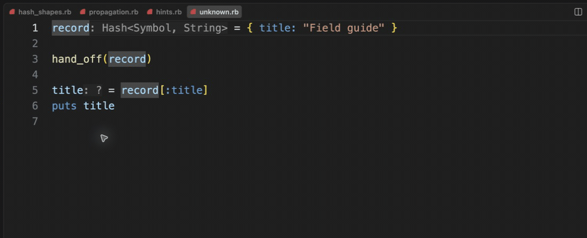

# Explicit unknown types

[Video](demo.mp4) · [Source example](../../../../demos/fixtures/types/unknown.rb) · [Capture metadata](metadata.json)

1. Pass a Hash to an unresolved call.
2. Show Hover on the later local: its type remains unknown, with an explanation.

Recorded with the current source in a temporary extension development host.

Read pauses are edited; typing frames use 60–100 ms ordinary gaps where typing is shown.

Keyboard commands and mouse interactions use the real editor. Pointer motion between sampled frames is not continuous.
