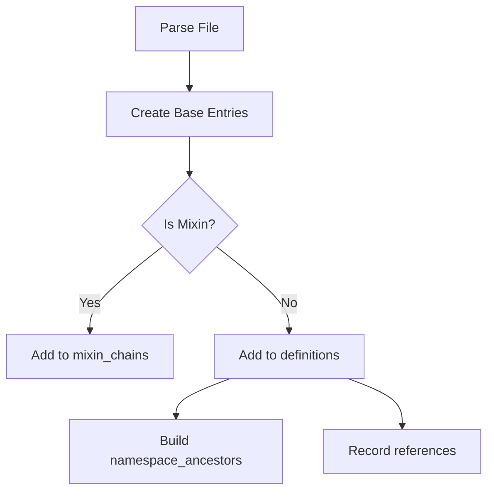
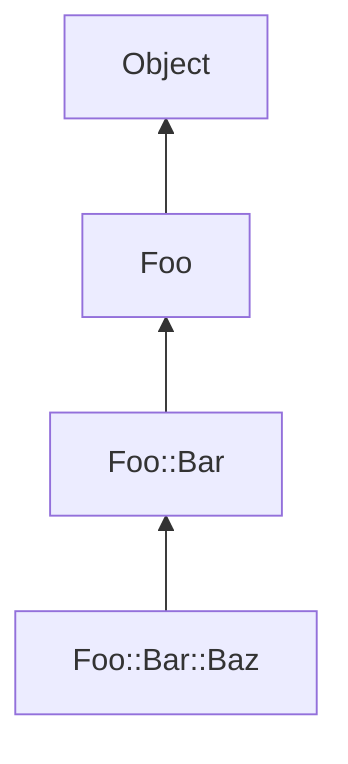

# Ruby Language Server (RLS) - Index Design Specification

## Core Data Structures

### 1. Validated Primitive Types
```rust
#[derive(Debug, Clone, Hash, Eq, PartialEq)]
pub struct RubyNamespace(String);  // Valid class/module name
#[derive(Debug, Clone, Hash, Eq, PartialEq)]
pub struct RubyMethod(String);     // Valid snake_case method name
#[derive(Debug, Clone, Hash, Eq, PartialEq)]
pub struct RubyConstant(String);  // Valid uppercase-first constant
```

## Validation Rules:

### RubyNamespace:

- Starts with uppercase letter (Unicode-aware)
- Contains only [A-Za-z0-9_] with Unicode XID support
- No :: separators allowed

### RubyMethod:

- Snake_case format
- Starts with lowercase/underscore

### RubyConstant:

- PascalCase format
- Starts with uppercase letter

### 2. Fully Qualified Name (FQN)
```rust
#[derive(Debug, Clone, Eq, PartialEq, Hash)]
pub enum FullyQualifiedName {
    Namespace(Vec<RubyNamespace>),
    InstanceMethod(Vec<RubyNamespace>, RubyMethod),
    ClassMethod(Vec<RubyNamespace>, RubyMethod),
    Constant(Vec<RubyNamespace>, RubyConstant),
}
```

#### Semantics:

- Namespace: Represents class/module hierarchy (e.g., ["Foo", "Bar"] = Foo::Bar)
- InstanceMethod: Foo#bar with owner context
- ClassMethod: Foo.bar with owner context
- Constant: Foo::CONST with namespace

### 3. Entry - Fundamental Index Unit
```rust
#[derive(Debug, Clone)]
pub struct Entry {
    pub fqn: FullyQualifiedName,
    pub location: Location,  // LSP Location (uri + range)
    pub kind: EntryKind,
    pub metadata: HashMap<String, String>,
}

#[derive(Debug, Clone, PartialEq)]
pub enum EntryKind {
    Class {
        superclass: Option<FullyQualifiedName>,
        is_singleton: bool,
    },
    Module,
    Method {
        kind: MethodKind,
        parameters: Vec<String>,
        owner: FullyQualifiedName,
        origin: MethodOrigin,
        visibility: Visibility,
    },
    Constant {
        value: Option<String>,
        visibility: Option<Visibility>,
    },
}

#[derive(Debug, Clone, Copy, PartialEq)]
pub enum Visibility { Public, Protected, Private }

#[derive(Debug, Clone, Copy, PartialEq)]
pub enum MethodKind { Instance, Class, Singleton, ModuleFunction }

#[derive(Debug, Clone, PartialEq)]
pub enum MethodOrigin {
    Direct,
    Inherited(FullyQualifiedName),
    Included(FullyQualifiedName),
    Extended(FullyQualifiedName),
    Prepended(FullyQualifiedName),
}
```

## Index Architecture

### 4. RubyIndex - Central Data Store
```rust
#[derive(Debug)]
pub struct RubyIndex {
    // Core mappings
    pub file_entries: HashMap<Url, Vec<Entry>>,
    pub definitions: HashMap<FullyQualifiedName, Vec<Entry>>,
    pub references: HashMap<FullyQualifiedName, Vec<Location>>,

    // Inheritance/Mixins
    pub inheritance: HashMap<FullyQualifiedName, InheritanceInfo>, // TODO
    pub mixin_relationships: HashMap<FullyQualifiedName, Vec<Mixin>>,

    // Reverse lookups
    pub method_origins: HashMap<FullyQualifiedName, Vec<FullyQualifiedName>>, // TODO
    pub singleton_classes: HashMap<FullyQualifiedName, FullyQualifiedName>, // TODO
}

#[derive(Debug)]
pub struct InheritanceInfo {
    pub superclasses: Vec<FullyQualifiedName>,
    pub included: Vec<FullyQualifiedName>,
    pub prepended: Vec<FullyQualifiedName>,
}

#[derive(Debug)]
pub enum Mixin {
    Include(FullyQualifiedName),
    Extend(FullyQualifiedName),
    Prepend(FullyQualifiedName),
}
```

## Data Flow Pipeline

### 5. Index Construction Phases

#### 1. AST Parsing:

- Extract raw entities from source files
- Create preliminary entries with direct relationships

#### 2. Primary Indexing:



#### 3. Mixin Resolution:

- Process include/extend/prepend statements
- Generate derivative entries for mixed-in methods
- Update method origins and visibility

#### 4. Ancestry Resolution:

- Build complete inheritance chains
- Resolve method overrides
- Validate superclass relationships

### 6. Mixin Handling Algorithm
```rust
fn process_mixin(index: &mut RubyIndex, target: &FullyQualifiedName, mixin: Mixin) {
    let source = match mixin {
        Mixin::Include(fqn) | Mixin::Extend(fqn) | Mixin::Prepend(fqn) => fqn,
    };

    if let Some(source_entries) = index.definitions.get(&source) {
        for entry in source_entries {
            if let EntryKind::Method { .. } = &entry.kind {
                let mut derived = create_derived_entry(entry, target, &mixin);
                index.add_entry(derived);
                index.link_method_origin(&entry.fqn, &derived.fqn);
            }
        }
    }
}
```

## Key Relationships

### 7. Method Origin Tracking

| Origin Type | Example | Visibility Handling |
|-------------|---------|---------------------|
| Direct      | def Foo#bar | Original visibility |
| Included    | include M | Module functions -> Private |
| Extended    | extend M | Preserves visibility |
| Prepended   | prepend M | Priority resolution |

### 8. Namespace Ancestry



#### Storage:

```rust
namespace_ancestors: {
    "Foo::Bar::Baz": ["Foo::Bar", "Foo"],
    "Foo::Bar": ["Foo"],
    "Foo": []
}
```

## Example Scenarios

### 9. Module Function Inclusion

```ruby
module Logging
  module_function
  def log(msg) = puts(msg)
end

class Application
  include Logging
end
```
#### Index Entries:

- Original Method:
  - FQN: Logging#log
  - Kind: Method { kind: ModuleFunction, ... }

- Generated Class Method:
  - FQN: Logging.log

- Included Instance Method:
  - FQN: Application#log
  - Visibility: Private
  - Origin: Included(Logging#log)

### 10. Class Inheritance

```ruby
class Animal
  def speak = puts("...")
end

class Dog < Animal
  def speak = puts("Woof!")
end
```
#### Index State:

```rust
inheritance: {
    "Dog": InheritanceInfo {
        superclasses: ["Animal"],
        included: [],
        prepended: []
    }
}

definitions: {
    "Animal#speak": Entry { /* base implementation */ },
    "Dog#speak": Entry { /* override */ }
}
```

## Edge Case Handling

### 11. Singleton Classes

```rust
FullyQualifiedName::Namespace(vec![
    RubyNamespace::new("Foo"),
    RubyNamespace::new("singleton_class")
])
```

#### Handling:

- Special namespace segment `singleton_class`
- Separate storage in `singleton_classes` map

### 12. Dynamic Metaprogramming

```ruby
class Dynamic
  [:method1, :method2].each do |m|
    define_method(m) { puts m }
  end
end
```
#### Indexing:

- Store method names in metadata
- Flag with `is_dynamic: true`
- Special handling in reference resolution

## Performance Considerations

### Batch Processing

- Process mixins after full AST parse
- Bulk updates to index maps

### Caching Strategies

```rust
struct QueryCache {
    method_visibility: LruCache<FullyQualifiedName, Visibility>,
    ancestor_chains: LruCache<FullyQualifiedName, Vec<FullyQualifiedName>>,
}
```

#### Incremental Updates:

- Track changed files with MD5 hashes
- Partial reindexing using dependency graph

## Future Extensions
Type Inference Layer:

```rust
type_registry: HashMap<FullyQualifiedName, TypeSignature>,
```

### Document Symbol Support:

```rust
document_symbols: HashMap<Url, Vec<SymbolInformation>>,
```

### Code Lens Integration:

```rust
code_lenses: HashMap<Url, Vec<CodeLens>>,
```
